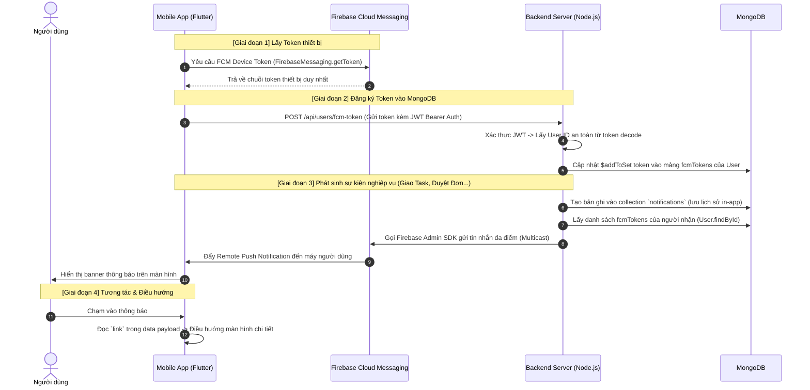

# Hướng Dẫn Tích Hợp Push Notification (FCM) Cho Backend (Node.js/JavaScript) & Database (MongoDB)

Tài liệu này được biên soạn dành cho đội ngũ phát triển **Backend (Node.js / Express)** và quản trị **Database (MongoDB)**. Tài liệu giải thích chi tiết: **Cần làm gì?**, **Tại sao phải làm như vậy?**, kèm theo mã nguồn mẫu, cấu trúc dữ liệu và các **nguyên tắc bảo mật thông tin tối quan trọng** để phòng chống rủi ro khai thác.

---

> [!NOTE]
> **Quy ước an toàn thông tin (Security Notice)**:
> Toàn bộ các định danh (ID), địa chỉ mạng (URL), email và mã token trong tài liệu này là **dữ liệu mẫu giả lập** (dummy data), được thiết kế để minh họa kiến trúc mà không làm lộ bất kỳ thông tin thực tế nào của hệ thống.

---

## 1. Kiến Trúc Hoạt Động & Tại Sao Cần Làm?

### 1.1. Luồng truyền tin tổng thể



---

### 1.2. Tại sao Backend & Database cần tham gia?

1. **Tại sao không để Client tự gửi thông báo cho nhau?**
   - Ứng dụng di động không thể và không bao giờ được phép giữ quyền quản trị (`Service Account Private Key`) của Firebase vì hacker có thể decompile file APK/IPA và chiếm toàn quyền kiểm soát project Firebase.
   - Chỉ Backend Server mới có quyền gửi thông báo thông qua **Firebase Admin SDK**.

2. **Tại sao một User lại cần một mảng `fcmTokens: []` thay vì 1 chuỗi token duy nhất?**
   - **Đa thiết bị (Multi-device)**: Một nhân viên có thể sử dụng đồng thời một điện thoại công việc (Android) và một máy tính bảng hoặc điện thoại cá nhân (iOS). Nếu chỉ lưu 1 token dạng string đơn lẻ, thiết bị đăng nhập sau sẽ ghi đè và làm mất thông báo của thiết bị trước.
   - **Cài đặt lại ứng dụng (Reinstall)**: Khi người dùng gỡ cài đặt app và cài lại, Firebase sẽ cấp một token mới. Nếu dùng mảng, hệ thống có thể lưu token mới mà không làm gián đoạn các phiên đăng nhập hợp lệ khác.

3. **Vòng đời của Token (Token Lifecycle)**:
   - **Khi Login**: Gửi token thiết bị lên Backend để lưu vào MongoDB.
   - **Khi Logout**: Gửi yêu cầu xóa token đó khỏi MongoDB để thiết bị này không còn nhận thông báo của tài khoản cũ.
   - **Khi Token bị vô hiệu hóa (Pruning)**: Nếu người dùng xóa ứng dụng, Firebase sẽ trả về mã lỗi `messaging/registration-token-not-registered`. Backend cần tự động xóa token hỏng này khỏi Database để tránh lãng phí băng thông và giảm thời gian chờ ở các lần gửi tiếp theo.

---

## 2. Nhiệm Vụ Của Database (MongoDB)

### 2.1. Cập nhật Collection `User`

#### Cần làm gì?
Bổ sung trường `fcmTokens` vào User Schema để lưu danh sách các thiết bị nhận thông báo của từng nhân viên:

```javascript
// models/User.model.js
const mongoose = require('mongoose');

const FcmTokenSchema = new mongoose.Schema({
  token: {
    type: String,
    required: true,
    trim: true,
  },
  device: {
    type: String,
    enum: ['android', 'ios', 'web', 'unknown'],
    default: 'unknown'
  },
  updatedAt: {
    type: Date,
    default: Date.now
  }
}, { _id: false });

const UserSchema = new mongoose.Schema({
  // ... các trường hiện có (name, email, department, role...) ...
  
  fcmTokens: {
    type: [FcmTokenSchema],
    default: []
  }
}, { timestamps: true });

// TẠI SAO CẦN INDEX NÀY?
// Index giúp tăng tốc tối đa các thao tác tìm kiếm, $addToSet và $pull token,
// giảm thời gian query từ O(N) xuống O(log N).
UserSchema.index({ "fcmTokens.token": 1 });

module.exports = mongoose.model('User', UserSchema);
```

---

### 2.2. Collection `Notification` (Lưu lịch sử thông báo In-App)

#### Cần làm gì?
Khi gửi push notification ra màn hình khóa, hệ thống đồng thời phải lưu một bản ghi vào database để người dùng có thể xem lại trong **Notification Center** của ứng dụng:

```javascript
// models/Notification.model.js
const mongoose = require('mongoose');

const NotificationSchema = new mongoose.Schema({
  recipient: {
    type: mongoose.Schema.Types.ObjectId,
    ref: 'User',
    required: true,
    index: true // Index để query danh sách thông báo của user nhanh chóng
  },
  sender: {
    type: mongoose.Schema.Types.ObjectId,
    ref: 'User',
    default: null
  },
  type: {
    type: String,
    enum: [
      'task_assigned',        // Được giao việc mới
      'task_status_changed',  // Trạng thái task thay đổi
      'leave_approved',       // Đơn nghỉ phép được duyệt
      'leave_rejected',       // Đơn nghỉ phép bị từ chối
      'overtime_approved',    // Đơn OT được duyệt
      'general_announcement'  // Thông báo chung
    ],
    required: true
  },
  title: {
    type: String,
    required: true,
    trim: true
  },
  body: {
    type: String,
    required: true,
    trim: true
  },
  link: {
    type: String,
    default: '' // Đường dẫn deep link trong app (ví dụ: /tasks/65a000000000000000000002)
  },
  isRead: {
    type: Boolean,
    default: false,
    index: true // Index để đếm unread count cực nhanh
  }
}, { timestamps: true });

// Index kép tối ưu hóa cho truy vấn lấy danh sách thông báo theo thứ tự mới nhất
NotificationSchema.index({ recipient: 1, createdAt: -1 });

module.exports = mongoose.model('Notification', NotificationSchema);
```

---

## 3. Nhiệm Vụ Của Backend (Node.js / Express)

### 3.1. Cài đặt thư viện Firebase Admin

```bash
npm install firebase-admin
```

---

### 3.2. Cấu hình Firebase Admin an toàn (KHÔNG lộ Key)

#### Cần làm gì?
1. Vào **Firebase Console** ➔ **Project Settings** ➔ **Service Accounts**.
2. Nhấn **Generate new private key** để tải file JSON credentials về.
3. **BẢO MẬT**: Không bao giờ commit file này lên Git repository. Hãy lưu đường dẫn vào file `.env` hoặc lưu nội dung JSON vào biến môi trường:

```env
# File .env (Ví dụ giả lập)
FIREBASE_CREDENTIALS_PATH=./config/credentials/firebase-service-account.json
# Hoặc lưu trực tiếp dưới dạng chuỗi base64 nếu dùng Docker/K8s/Cloud Run:
# FIREBASE_SERVICE_ACCOUNT_BASE64=eyJ0eXBlIjoic2VydmljZV9hY2NvdW50IiwicHJvamVjdF9pZCI6ImV4YW1wbGUtcHJvamVjdCIs...
```

Khởi tạo Firebase Admin:

```javascript
// config/firebase.js
const admin = require('firebase-admin');
const path = require('path');

let firebaseApp = null;

function initFirebase() {
  if (firebaseApp) return firebaseApp;

  try {
    const credPath = process.env.FIREBASE_CREDENTIALS_PATH;
    if (credPath) {
      firebaseApp = admin.initializeApp({
        credential: admin.credential.cert(path.resolve(credPath))
      });
      console.log('✅ Firebase Admin SDK khởi tạo thành công.');
    } else {
      console.warn('⚠️ Chưa cấu hình FIREBASE_CREDENTIALS_PATH. Push notification sẽ bị vô hiệu hóa.');
    }
  } catch (error) {
    console.error('❌ Lỗi khởi tạo Firebase Admin SDK:', error.message);
  }

  return firebaseApp;
}

module.exports = { initFirebase, admin };
```

---

### 3.3. Xây dựng 2 API Endpoints Quản Lý Token Thiết Bị

#### API 1: Đăng ký Token (`POST /api/users/fcm-token`)

> [!IMPORTANT]
> **Tại sao dùng `$addToSet`?**
> `$addToSet` đảm bảo tính lũy đẳng (Idempotent): Nếu cùng một token gửi lên 10 lần thì MongoDB cũng chỉ lưu đúng 1 phần tử trong mảng, không bao giờ bị trùng lặp.

```javascript
// controllers/userNotification.controller.js
const User = require('../models/User.model');

/**
 * Đăng ký hoặc làm mới FCM Device Token
 * Route: POST /api/users/fcm-token
 * Header: Authorization: Bearer <JWT_TOKEN>
 */
exports.registerFcmToken = async (req, res) => {
  try {
    const { token, device } = req.body;

    // 1. Kiểm tra đầu vào (Input validation)
    if (!token || typeof token !== 'string' || token.trim().length < 20 || token.length > 500) {
      return res.status(400).json({ success: false, message: 'FCM Token không hợp lệ.' });
    }

    const validDevice = ['android', 'ios', 'web'].includes(device) ? device : 'unknown';
    const userId = req.user.id; // Lấy từ JWT Auth Middleware (KHÔNG lấy từ req.body)

    // 2. Trước tiên xóa token này nếu nó đang thuộc về tài khoản khác trên cùng một máy
    // (ví dụ: User A logout, User B login trên cùng điện thoại)
    await User.updateOne(
      { "fcmTokens.token": token },
      { $pull: { fcmTokens: { token } } }
    );

    // 3. Thêm token mới vào User hiện tại
    await User.findByIdAndUpdate(userId, {
      $addToSet: {
        fcmTokens: {
          token: token.trim(),
          device: validDevice,
          updatedAt: new Date()
        }
      }
    });

    return res.status(200).json({
      success: true,
      message: 'Đăng ký nhận thông báo thành công.'
    });
  } catch (error) {
    console.error('Lỗi registerFcmToken:', error);
    return res.status(500).json({ success: false, message: 'Lỗi máy chủ nội bộ.' });
  }
};
```

---

#### API 2: Hủy Token khi Đăng Xuất (`DELETE /api/users/fcm-token`)

> [!IMPORTANT]
> **Tại sao phải gọi API này khi Logout?**
> Nếu người dùng đăng xuất khỏi app mà Backend không xóa token, khi có tác vụ mới gửi đến tài khoản đó, thông báo vẫn sẽ hiện trên điện thoại của họ. Việc gọi xóa token là yêu cầu bắt buộc để đảm bảo quyền riêng tư.

```javascript
/**
 * Hủy FCM Device Token khi đăng xuất
 * Route: DELETE /api/users/fcm-token
 * Header: Authorization: Bearer <JWT_TOKEN>
 */
exports.removeFcmToken = async (req, res) => {
  try {
    const { token } = req.body;
    const userId = req.user.id;

    if (!token || typeof token !== 'string') {
      return res.status(400).json({ success: false, message: 'Token là bắt buộc.' });
    }

    await User.findByIdAndUpdate(userId, {
      $pull: {
        fcmTokens: { token: token.trim() }
      }
    });

    return res.status(200).json({
      success: true,
      message: 'Hủy đăng ký token thành công.'
    });
  } catch (error) {
    console.error('Lỗi removeFcmToken:', error);
    return res.status(500).json({ success: false, message: 'Lỗi máy chủ nội bộ.' });
  }
};
```

---

### 3.4. Module Dịch Vụ Gửi Thông Báo Kèm Cơ Chế Dọn Dẹp Token Rác (Token Pruning)

#### Cần làm gì?
Xây dựng một module dùng chung `notification.service.js`:

```javascript
// services/notification.service.js
const { admin } = require('../config/firebase');
const User = require('../models/User.model');
const Notification = require('../models/Notification.model');

/**
 * Gửi thông báo đến người dùng qua FCM và lưu lịch sử vào Database
 * 
 * @param {Object} params
 * @param {string} params.recipientId - ObjectId dạng string của người nhận
 * @param {string} [params.senderId]  - ObjectId của người gửi (nếu có)
 * @param {string} params.type        - Loại thông báo (task_assigned, leave_approved...)
 * @param {string} params.title       - Tiêu đề thông báo
 * @param {string} params.body        - Nội dung tóm tắt
 * @param {string} [params.link]      - Đường dẫn điều hướng trong app (e.g. /tasks/65a000000000000000000002)
 */
async function sendNotificationToUser({ recipientId, senderId = null, type, title, body, link = '' }) {
  try {
    // 1. Lưu bản ghi vào MongoDB (Notification Center trong app)
    const notificationRecord = await Notification.create({
      recipient: recipientId,
      sender: senderId,
      type,
      title,
      body,
      link
    });

    // 2. Tìm danh sách token của người nhận
    const recipient = await User.findById(recipientId).select('fcmTokens');
    if (!recipient || !recipient.fcmTokens || recipient.fcmTokens.length === 0) {
      // Người dùng không có thiết bị nào đang đăng ký -> Chỉ lưu DB, dừng gửi push
      return { success: true, deliveredCount: 0, notificationId: notificationRecord._id };
    }

    const registrationTokens = recipient.fcmTokens.map(item => item.token);

    // 3. Chuẩn bị Payload cho FCM
    // LƯU Ý: Tất cả các giá trị trong object `data` PHẢI là chuỗi (string)
    const message = {
      notification: {
        title: title,
        body: body
      },
      data: {
        notificationId: notificationRecord._id.toString(),
        type: type,
        link: link || '',
        click_action: 'FLUTTER_NOTIFICATION_CLICK'
      },
      tokens: registrationTokens
    };

    // 4. Gửi đồng loạt bằng multicast
    const response = await admin.messaging().sendEachForMulticast(message);

    // 5. CƠ CHẾ TOKEN PRUNING (DỌN DẸP TOKEN HỎNG TỰ ĐỘNG)
    // Nếu token đã hết hạn hoặc người dùng gỡ cài đặt app, loại bỏ token khỏi MongoDB ngay lập tức
    if (response.failureCount > 0) {
      const tokensToRemove = [];
      response.responses.forEach((resp, idx) => {
        if (!resp.success) {
          const errorCode = resp.error?.code;
          if (
            errorCode === 'messaging/registration-token-not-registered' ||
            errorCode === 'messaging/invalid-registration-token'
          ) {
            tokensToRemove.push(registrationTokens[idx]);
          }
        }
      });

      if (tokensToRemove.length > 0) {
        await User.findByIdAndUpdate(recipientId, {
          $pull: { fcmTokens: { token: { $in: tokensToRemove } } }
        });
        console.log(`🧹 Đã dọn dẹp ${tokensToRemove.length} token hết hạn của User: ${recipientId}`);
      }
    }

    return {
      success: true,
      deliveredCount: response.successCount,
      notificationId: notificationRecord._id
    };
  } catch (error) {
    console.error('❌ Lỗi sendNotificationToUser:', error.message);
    // Không ném lỗi ra ngoài để tránh làm sập luồng nghiệp vụ chính
    return { success: false, error: error.message };
  }
}

module.exports = { sendNotificationToUser };
```

---

### 3.5. Ví Dụ Kích Hoạt Trong Luồng Nghiệp Vụ (Business Controllers)

#### Ví dụ 1: Khi giao Task mới cho nhân viên

```javascript
// controllers/task.controller.js (Ví dụ cấu trúc tương tự)
const Task = require('../models/Task.model');
const { sendNotificationToUser } = require('../services/notification.service');

exports.assignTask = async (req, res) => {
  try {
    const { taskId, assigneeId, taskTitle } = req.body;
    
    // ... logic cập nhật DB ...
    
    // Gửi thông báo đến nhân viên được giao việc
    // Dùng mã Object ID mẫu an toàn
    sendNotificationToUser({
      recipientId: assigneeId,
      senderId: req.user.id,
      type: 'task_assigned',
      title: 'Bạn được giao công việc mới',
      body: `Công việc: "${taskTitle}" cần được thực hiện.`,
      link: `/tasks/${taskId}` // Deep link để app mở thẳng vào chi tiết công việc
    });

    return res.status(200).json({ success: true, message: 'Giao việc thành công.' });
  } catch (error) {
    return res.status(500).json({ success: false, message: error.message });
  }
};
```

---

#### Ví dụ 2: Khi duyệt hoặc từ chối đơn xin nghỉ phép

```javascript
// controllers/leave.controller.js
const { sendNotificationToUser } = require('../services/notification.service');

exports.approveLeaveRequest = async (req, res) => {
  try {
    const { requestId, applicantId, status } = req.body; // status: 'approved' | 'rejected'

    // ... logic cập nhật trạng thái đơn ...

    const isApproved = status === 'approved';
    sendNotificationToUser({
      recipientId: applicantId,
      senderId: req.user.id,
      type: isApproved ? 'leave_approved' : 'leave_rejected',
      title: isApproved ? 'Đơn xin nghỉ phép đã được duyệt' : 'Đơn xin nghỉ phép bị từ chối',
      body: isApproved 
        ? 'Quản lý đã phê duyệt đơn xin nghỉ của bạn.' 
        : 'Đơn xin nghỉ của bạn không được phê duyệt. Nhấn để xem chi tiết.',
      link: `/leave-requests/${requestId}`
    });

    return res.status(200).json({ success: true, message: 'Đã cập nhật trạng thái đơn.' });
  } catch (error) {
    return res.status(500).json({ success: false, message: error.message });
  }
};
```

---

## 4. Nguyên Tắc Bảo Mật Tuyệt Đối (Anti-Exploitation Guidelines)

Dưới đây là các lưu ý sống còn về bảo mật để hệ thống không bị hacker khai thác lỗ hổng:

| Nguy cơ tấn công | Cách phòng tránh ở Backend |
| :--- | :--- |
| **IDOR (Insecure Direct Object Reference)** | **TUYỆT ĐỐI KHÔNG** nhận `userId` từ `req.body` trong các endpoint đăng ký token. Phải lấy `userId = req.user.id` từ **JWT Token** đã được verify bởi middleware xác thực. Nếu lấy từ body, hacker có thể gửi token của họ nhưng gán vào ID của Tổng giám đốc để đọc trộm thông báo. |
| **NoSQL Injection** | Luôn ép kiểu và kiểm tra đầu vào: `typeof token === 'string'`. Không truyền trực tiếp object từ client vào câu truy vấn MongoDB. |
| **Lộ Dữ Liệu Nhạy Cảm (Data Leak)** | Push Notification sẽ hiển thị nội dung trên màn hình khóa điện thoại (người lạ có thể nhìn thấy). **KHÔNG** đưa mật khẩu tạm thời, mã OTP, số dư tài chính, căn cước công dân vào trường `body` hoặc `data`. Hãy chỉ gửi tiêu đề tóm tắt và `link`. Khi người dùng mở app, app sẽ dùng JWT gọi API lấy thông tin chi tiết. |
| **Spam / DoS Token Registry** | Áp dụng `express-rate-limit` cho endpoint `POST /api/users/fcm-token` (ví dụ tối đa 10 request / phút trên một IP). |
| **Lộ Private Key Firebase** | Không lưu file credentials JSON trong thư mục public của web server. Đưa đường dẫn vào `.gitignore`. Sử dụng IAM Role hoặc Secret Manager nếu triển khai trên môi trường Cloud (AWS, GCP, Render). |

---

## 5. Tóm Tắt Danh Sách Việc Cần Làm (Checklist)

- [ ] **MongoDB**:
  - [ ] Thêm mảng `fcmTokens: [{ token, device, updatedAt }]` vào schema `User`.
  - [ ] Tạo index `{ "fcmTokens.token": 1 }`.
  - [ ] Tạo collection `Notification` để lưu lịch sử thông báo in-app và quản lý `isRead`.
- [ ] **Backend (Node.js)**:
  - [ ] `npm install firebase-admin`.
  - [ ] Tải Service Account Key từ Firebase Console đặt vào thư mục bảo mật và khai báo đường dẫn trong `.env`.
  - [ ] Tạo 2 route: `POST /api/users/fcm-token` và `DELETE /api/users/fcm-token` (có JWT Auth Middleware bảo vệ).
  - [ ] Tạo service `sendNotificationToUser` hỗ trợ gửi multicast và cơ chế tự động dọn dẹp token rác.
  - [ ] Gắn hàm gửi thông báo vào các controller nghiệp vụ (giao việc, đổi trạng thái quy trình, duyệt nghỉ phép).
