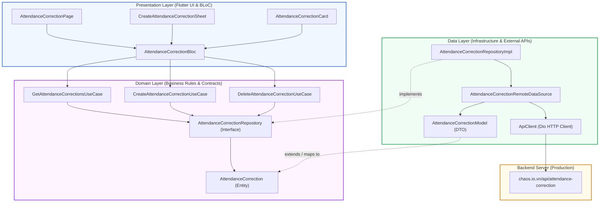
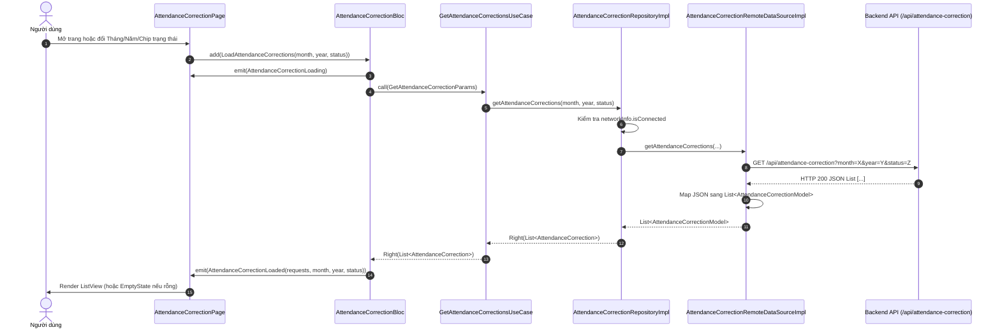
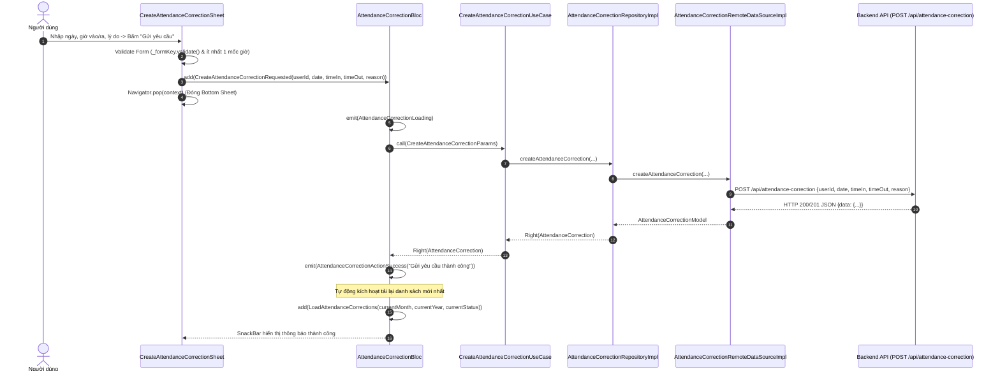
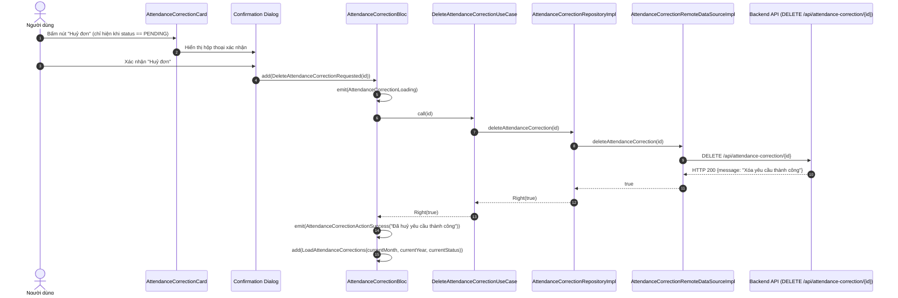

# Kế hoạch Triển Khai Kỹ Thuật: Tính Năng "Xin Chấm Công Lại" (Attendance Correction)

> **Mục tiêu tài liệu:** Đặc tả toàn diện kiến trúc phần mềm, sơ đồ luồng dữ liệu (Data Flow), cấu trúc tổ chức thư mục/tệp và kế hoạch triển khai chi tiết cho tính năng **Xin chấm công lại** (Attendance Correction) trên ứng dụng di động Flutter theo chuẩn Clean Architecture + BLoC và Design System đã quy định trong `AGENTS.md`.

---

## 1. Root Cause & Context Analysis

### 1.1. Hiện trạng (Current Behavior)
- Trên ứng dụng web (`chaos.io.vn/attendance-correction`), nhân viên và quản trị viên đã có tính năng **Quản lý Chấm công lại** để tạo yêu cầu bổ sung/chỉnh sửa giờ vào (Check-in) và giờ ra (Check-out) do quên chấm công.
- Trên ứng dụng Flutter mobile:
  - Tab **Yêu cầu** (`/requests`) hiện tại chỉ có 2 chức năng con: **Xin nghỉ phép** (`/leave`) và **Kê khai tăng ca** (`/overtime`).
  - Chưa có màn hình, route điều hướng, khối BLoC quản lý trạng thái, Use Cases nghiệp vụ, cũng như Data Source gọi API backend cho tính năng Chấm công lại.

### 1.2. Nguyên nhân gốc rễ (Root Cause)
- Module `lib/features/requests/` chưa được mở rộng để tiếp nhận quy trình nghiệp vụ mới này.
- Thiếu các hợp đồng Domain (Entity, Repository Interface, Use Cases), các thành phần Data (DTO Model, Remote DataSource qua Dio, Repository Impl), và các thành phần Presentation (BLoC, Cards, Sheets, Page) tương ứng.

### 1.3. Phạm vi ảnh hưởng (Scope)
- **Khu vực mở rộng (Tạo mới hoàn toàn)**:
  - `lib/features/requests/domain/` (Entity, Repository interface, 3 Use Cases).
  - `lib/features/requests/data/` (Model DTO, Remote DataSource, Repository Impl).
  - `lib/features/requests/presentation/` (BLoC, Widgets, Page).
- **Khu vực tích hợp (Sửa đổi có kiểm soát)**:
  - `lib/core/constants/api_constants.dart` (Bổ sung endpoint API).
  - `lib/features/requests/presentation/pages/request_list_page.dart` (Bổ sung nút sub-nav "Chấm công lại").
  - `lib/injection_container.dart` (Đăng ký Dependency Injection cho GetIt).
  - `lib/main.dart` (Cung cấp `AttendanceCorrectionBloc` qua `MultiBlocProvider`).
  - `lib/app/router.dart` (Đăng ký Route `/attendance-correction` vào Branch 4).
  - `lib/features/home/presentation/pages/home_page.dart` (AppBar title và logic điều hướng nút Back).
- **Khu vực giữ nguyên**: Toàn bộ các module khác (Dự án, Chấm công vân tay, Thông báo, Tài sản, Hồ sơ cá nhân) không bị ảnh hưởng.

---

## 2. Kiến Trúc Hệ Thống & Chiều Phụ Thuộc (Clean Architecture)

Tuân thủ nghiêm ngặt quy tắc Dependency Rule trong `AGENTS.md`: Tầng ngoài phụ thuộc tầng trong, tầng Domain là trung tâm và hoàn toàn độc lập với Flutter UI, Dio hay Database.



### Nguyên tắc ranh giới kiến trúc:
1. **Domain Layer**:
   - Chứa thực thể `AttendanceCorrection` và enum `AttendanceCorrectionStatus`.
   - Chứa interface `AttendanceCorrectionRepository` trả về `Either<Failure, T>`.
   - Hoàn toàn độc lập, không import bất kỳ package Flutter UI hay Dio/HTTP nào.
2. **Data Layer**:
   - `AttendanceCorrectionModel` kế thừa `AttendanceCorrection`, chịu trách nhiệm parse JSON từ backend và serialize dữ liệu gửi đi.
   - `AttendanceCorrectionRemoteDataSource` trực tiếp gọi Dio với endpoint `/api/attendance-correction`.
   - `AttendanceCorrectionRepositoryImpl` bọc lỗi hạ tầng thành `Failure` ứng dụng và kiểm tra trạng thái mạng `NetworkInfo`.
3. **Presentation Layer**:
   - `AttendanceCorrectionBloc` nhận UI Event, gọi Use Case và emit State bất biến.
   - Các widget (`AttendanceCorrectionCard`, `CreateAttendanceCorrectionSheet`) chỉ đảm nhận render từ state và gửi event về BLoC, không chứa business logic hay gọi trực tiếp Repository.

---

## 3. Sơ Đồ Luồng Dữ Liệu Chi Tiết (Data Flow & State Sequences)

### 3.1. Luồng 1: Tải danh sách và lọc theo Tháng/Năm/Trạng thái (Read Flow)



---

### 3.2. Luồng 2: Tạo mới yêu cầu chấm công lại (Create Flow)



---

### 3.3. Luồng 3: Huỷ yêu cầu đang chờ duyệt (Delete/Cancel Flow)



---

## 4. Cấu Trúc Tổ Chức Tệp & Thư Mục (File Organization Tree)

```text
lib/
├── core/
│   └── constants/
│       └── [MODIFY] api_constants.dart             # Khai báo endpoint /api/attendance-correction
│
├── features/
│   ├── home/
│   │   └── presentation/pages/
│   │       └── [MODIFY] home_page.dart             # AppBar title "Xin chấm công lại" & Back nav
│   │
│   └── requests/                                   # Feature Module: Yêu Cầu
│       ├── data/
│       │   ├── datasources/
│       │   │   ├── leave_remote_data_source.dart
│       │   │   ├── overtime_remote_data_source.dart
│       │   │   └── [NEW] attendance_correction_remote_data_source.dart # Gọi HTTP API qua Dio
│       │   ├── models/
│       │   │   └── [NEW] attendance_correction_model.dart             # DTO + JSON mapper
│       │   └── repositories/
│       │       ├── leave_repository_impl.dart
│       │       ├── overtime_repository_impl.dart
│       │       └── [NEW] attendance_correction_repository_impl.dart   # Repo Impl + Error Handling
│       │
│       ├── domain/
│       │   ├── entities/
│       │   │   └── [NEW] attendance_correction.dart                   # Domain Entity & Status Enum
│       │   ├── repositories/
│       │   │   ├── leave_repository.dart
│       │   │   ├── overtime_repository.dart
│       │   │   └── [NEW] attendance_correction_repository.dart        # Contract Repository Interface
│       │   └── usecases/
│       │       ├── leave_usecases.dart
│       │       ├── overtime_usecases.dart
│       │       └── [NEW] attendance_correction_usecases.dart          # Get, Create, Delete Use Cases
│       │
│       └── presentation/
│           ├── bloc/
│           │   ├── leave/
│           │   ├── overtime/
│           │   └── attendance_correction/
│           │       ├── [NEW] attendance_correction_event.dart         # Bloc Events
│           │       ├── [NEW] attendance_correction_state.dart         # Bloc States
│           │       └── [NEW] attendance_correction_bloc.dart          # Bloc Coordinator
│           ├── pages/
│           │   ├── leave_request_page.dart
│           │   ├── overtime_page.dart
│           │   ├── [MODIFY] request_list_page.dart                    # Thêm nút Sub-nav Chấm công lại
│           │   └── [NEW] attendance_correction_page.dart              # Màn hình chính danh sách & lọc
│           └── widgets/
│               ├── [NEW] attendance_correction_card.dart              # Card hiển thị & xem chi tiết
│               └── [NEW] create_attendance_correction_sheet.dart      # Bottom Sheet tạo đơn mới
│
├── app/
│   └── [MODIFY] router.dart                        # Đăng ký Route vào StatefulShellRoute Branch 4
│
├── [MODIFY] injection_container.dart               # Đăng ký GetIt DI (Bloc, UseCases, Repo, DS)
├── [MODIFY] main.dart                              # MultiBlocProvider đăng ký AttendanceCorrectionBloc
│
test/
└── [NEW] attendance_correction_test.dart           # Unit tests kiểm tra Model, Status, Filter State
```

---

## 5. Bảng Chi Tiết Nhiệm Vụ Từng Tệp (Implementation Checklist)

| STT | Tệp tin | Trạng thái | Tầng kiến trúc | Vai trò / Nhiệm vụ chi tiết |
| :---: | :--- | :---: | :---: | :--- |
| 1 | `lib/core/constants/api_constants.dart` | **MODIFY** | Core | Khai báo hằng số `attendanceCorrection = '/api/attendance-correction'` |
| 2 | `lib/features/requests/domain/entities/attendance_correction.dart` | **NEW** | Domain | Entity bất biến `AttendanceCorrection` & enum `AttendanceCorrectionStatus` |
| 3 | `lib/features/requests/domain/repositories/attendance_correction_repository.dart` | **NEW** | Domain | Interface hợp đồng: `getAttendanceCorrections`, `createAttendanceCorrection`, `deleteAttendanceCorrection` |
| 4 | `lib/features/requests/domain/usecases/attendance_correction_usecases.dart` | **NEW** | Domain | Các Single-purpose Use Cases: `GetAttendanceCorrectionsUseCase`, `CreateAttendanceCorrectionUseCase`, `DeleteAttendanceCorrectionUseCase` |
| 5 | `lib/features/requests/data/models/attendance_correction_model.dart` | **NEW** | Data | DTO Model chuyển đổi JSON response thành Entity an toàn |
| 6 | `lib/features/requests/data/datasources/attendance_correction_remote_data_source.dart` | **NEW** | Data | Thực hiện gọi API qua `ApiClient` (`Dio`), truyền query params và body |
| 7 | `lib/features/requests/data/repositories/attendance_correction_repository_impl.dart` | **NEW** | Data | Triển khai interface Repository, kiểm tra `NetworkInfo`, bọc lỗi thành `Failure` |
| 8 | `lib/features/requests/presentation/bloc/attendance_correction/attendance_correction_event.dart` | **NEW** | Presentation | Các Event: Tải danh sách, Tạo đơn mới, Huỷ đơn |
| 9 | `lib/features/requests/presentation/bloc/attendance_correction/attendance_correction_state.dart` | **NEW** | Presentation | Các State: `Initial`, `Loading`, `Loaded` (kèm getter `filteredRequests`), `ActionSuccess`, `Error` |
| 10 | `lib/features/requests/presentation/bloc/attendance_correction/attendance_correction_bloc.dart` | **NEW** | Presentation | BLoC điều phối trạng thái, tự động refresh danh sách sau khi tạo/xoá đơn |
| 11 | `lib/features/requests/presentation/widgets/attendance_correction_card.dart` | **NEW** | Presentation | Widget Card hiển thị thông tin tóm tắt và Bottom Sheet chi tiết đơn |
| 12 | `lib/features/requests/presentation/widgets/create_attendance_correction_sheet.dart` | **NEW** | Presentation | Form Bottom Sheet tạo đơn mới có đầy đủ DatePicker, TimePicker, Validation |
| 13 | `lib/features/requests/presentation/pages/attendance_correction_page.dart` | **NEW** | Presentation | Màn hình chính tích hợp `MonthYearPicker`, Filter Chips, Pull-to-refresh, EmptyState |
| 14 | `lib/features/requests/presentation/pages/request_list_page.dart` | **MODIFY** | Presentation | Thêm nút Sub-nav `Chấm công lại` kèm `SingleChildScrollView` chống tràn dòng |
| 15 | `lib/injection_container.dart` | **MODIFY** | Core / DI | Đăng ký Service Locator cho DataSource, Repository, UseCases, BLoC |
| 16 | `lib/main.dart` | **MODIFY** | App Root | Đăng ký `AttendanceCorrectionBloc` trong `MultiBlocProvider` toàn cục |
| 17 | `lib/app/router.dart` | **MODIFY** | Navigation | Đăng ký route `/attendance-correction` vào Branch 4 (Yêu cầu) |
| 18 | `lib/features/home/presentation/pages/home_page.dart` | **MODIFY** | Presentation | Cập nhật tiêu đề AppBar "Xin chấm công lại" và điều hướng nút Back |
| 19 | `test/attendance_correction_test.dart` | **NEW** | Test | Unit tests kiểm thử toàn diện Model mapper, Status extension, State filters |

---

## 6. Kế Hoạch Xác Minh & Kiểm Thử (Verification Plan)

### 6.1. Kiểm thử tĩnh (Static Analysis)
```powershell
flutter analyze
```
- **Mục tiêu:** 0 errors, 0 warnings, 0 lints.
- **Tiêu chí:** Không có biến unused, không có magic numbers, tuân thủ token hệ thống (`AppTokens`).

### 6.2. Kiểm thử tự động (Unit & Widget Tests)
```powershell
flutter test test/attendance_correction_test.dart
flutter test
```
- **Mục tiêu:** 100% test cases pass. Đảm bảo parser JSON hoạt động ổn định với cả response dạng bọc `{data: [...]}` hoặc mảng thô `[...]`.

### 6.3. Kiểm thử tương tác & Giao diện phòng thủ (Defensive UI Check)
1. **Điều hướng**: Tab Yêu cầu -> Bấm Sub-nav "Chấm công lại" -> Chuyển đến `/attendance-correction` với AppBar chuẩn. Bấm Back quay lại danh sách yêu cầu.
2. **Bộ lọc**: Đổi Tháng/Năm và bấm các Chip trạng thái (Tất cả, Chờ duyệt, Đã duyệt, Từ chối), danh sách phản hồi mượt mà.
3. **Tạo đơn**: Bấm `+ Thêm Yêu cầu`, kiểm tra DatePicker & TimePicker, kiểm tra form validation (bắt buộc nhập lý do), submit và xác nhận SnackBar xuất hiện + danh sách tự động cập nhật đơn mới.
4. **Huỷ đơn**: Đơn ở trạng thái "Chờ duyệt" có nút "Huỷ đơn", hiển thị popup xác nhận trước khi gọi API xoá.
5. **Theme & Responsive**: Chuyển đổi Dark Mode / Light Mode đảm bảo viền và độ tương phản chữ rõ ràng; kiểm tra màn hình nhỏ (360dp) không bị RenderFlex overflow.
