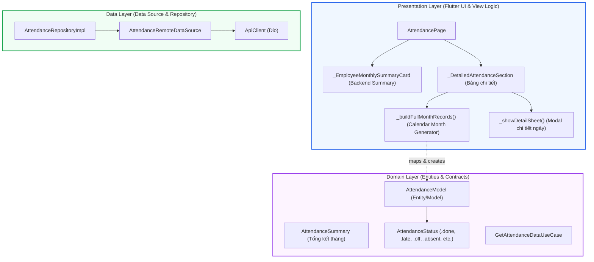
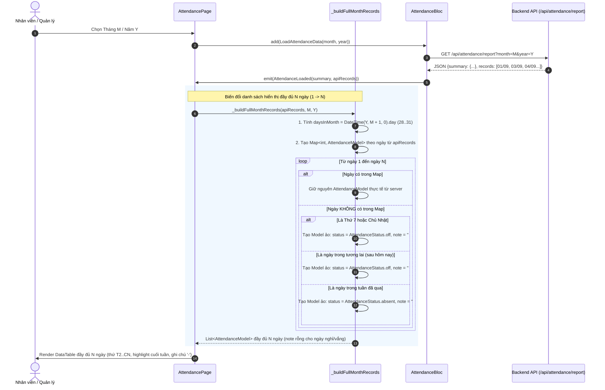

# Kế Hoạch Triển Khai: Hiển Thị Đầy Đủ Tất Cả Các Ngày Trong Bảng Chấm Công (Attendance Full-Month Calendar)

> **Mục tiêu:** Nâng cấp màn hình Bảng chấm công (`AttendancePage`) để hiển thị toàn bộ các ngày trong tháng ($1 \rightarrow 28/29/30/31$) theo lịch dương, thay vì chỉ hiển thị các ngày nhân viên có đi làm hoặc có dữ liệu chấm công từ API. Giúp nhân viên và quản lý theo dõi trực quan, minh bạch, tránh nhầm lẫn giữa ngày đi làm, ngày nghỉ cuối tuần và ngày vắng mặt.

---

## 1. Root Cause & Context Analysis

### 1.1. Hiện trạng (Current Behavior)
- Trong `lib/features/attendance/presentation/pages/attendance_page.dart`, widget `_DetailedAttendanceSection` đang render trực tiếp danh sách `records` từ API `/api/attendance/report`.
- Backend chỉ trả về bản ghi cho các ngày mà nhân viên có quẹt thẻ vân tay, có giờ làm hoặc có đơn từ được ghi nhận (thường từ 18 - 22 ngày/tháng).
- Các ngày còn lại trong tháng (Thứ 7, Chủ nhật, ngày nghỉ lễ, ngày vắng không quẹt thẻ, hoặc ngày chưa diễn ra trong tháng hiện tại) **hoàn toàn không xuất hiện** trong bảng.
- **Hệ quả**: Bảng chấm công bị nhảy cóc ngày (ví dụ: ngày 01/09 $\rightarrow$ ngày 04/09 $\rightarrow$ ngày 05/09 $\rightarrow$ ngày 08/09), khiến nhân viên bị nhầm lẫn, tưởng hệ thống làm mất dữ liệu hoặc không biết ngày đó là ngày nghỉ hay bị tính vắng mặt.

### 1.2. Nguyên nhân gốc rễ (Root Cause)
- Tầng Presentation xem `records` thô từ API như danh sách hàng của `DataTable`, thiếu bộ sinh lịch tháng trung gian (**Full-Month Calendar Generator**) để đối chiếu và lấp đầy toàn bộ $N$ ngày theo lịch dương của tháng được chọn.

### 1.3. Phạm vi ảnh hưởng (Scope)
- **Tập trung chính (Presentation Layer)**:
  - `lib/features/attendance/presentation/pages/attendance_page.dart`:
    - Thêm logic sinh danh sách đầy đủ tất cả các ngày trong tháng `_buildFullMonthRecords(records, month, year)`.
    - Phân loại trạng thái ngày (ngày làm việc thực tế, ngày nghỉ tuần T7/CN, ngày chưa tới, ngày trong tuần vắng mặt).
    - **Quy tắc ghi chú (Note)**: Ngày nghỉ cuối tuần và ngày vắng mặt sẽ **để trống ghi chú** (`note = ''`, hiển thị `-`), không gán chữ mặc định.
    - Cải tiến cột **Ngày**: Thêm thứ trong tuần (`T2, 01/09/2026`, `T7, 06/09/2026`, `CN, 07/09/2026`).
    - Thêm màu nền nhẹ (`DataRow.color`) cho các ngày Thứ 7 / Chủ nhật để phân cách trực quan các tuần làm việc.
    - Cập nhật Modal Bottom Sheet xem chi tiết khi bấm vào ngày nghỉ / vắng mặt.
    - Cập nhật bộ đếm tiêu đề: `X/N ngày đi làm (Tổng N ngày)` thay vì chỉ `X ngày`.
- **Tầng Kiểm thử (Test Suite)**:
  - Thêm unit test kiểm tra logic sinh ngày đầy đủ và phân loại ngày trong `test/features/attendance/attendance_full_month_test.dart`.
- **Phạm vi giữ nguyên (Untouched)**:
  - Tầng **Domain & Data**: Giữ nguyên `AttendanceModel`, `AttendanceSummary`, `AttendanceRepository`, `AttendanceRemoteDataSource`. Số liệu tổng kết tháng (`summary.totalCong`, `summary.workDays`, `summary.totalNormalHours`) vẫn sử dụng số liệu chuẩn xác do Backend tính toán.
  - Toàn bộ các module khác (Dự án, Yêu cầu, Thông báo, Hồ sơ) không bị ảnh hưởng.

---

## 2. Kiến Trúc Hệ Thống (Clean Architecture Breakdown)



### Ranh giới trách nhiệm:
1. **Data & Domain Layer**: Cung cấp dữ liệu thô từ API và các entity mô hình hoá nghiệp vụ.
2. **Presentation Layer**: Chịu trách nhiệm hoàn toàn việc ánh xạ dữ liệu chấm công vào lưới lịch tháng (Calendar View Pattern) mà không làm ô nhiễm business logic của Backend.

---

## 3. Sơ Đồ Luồng Dữ Liệu Chi Tiết (Sequence Flow)



---

## 4. Định Nghĩa Trạng Thái Chi Tiết Từng Loại Ngày (State Definitions)

| Loại ngày trong tháng | Điều kiện xác định | Trạng thái hiển thị (`StatusBadge`) | Giờ vào / ra | Giờ HC / OT | Số công | Ghi chú (`note`) |
| :--- | :--- | :--- | :---: | :---: | :---: | :--- |
| **1. Ngày có quẹt thẻ / đi làm** | Có record thực tế từ API | `Hoàn thành` / `Đi muộn` / `Về sớm` / `Nghỉ phép` | Giờ thực tế (`08:28`, `17:35`...) | Giờ thực tế | Công thực tế | Ghi chú từ server (hoặc `-` nếu rỗng) |
| **2. Ngày nghỉ cuối tuần** | Không có record & `weekday == 6 (T7)` hoặc `7 (CN)` | `Ngày nghỉ` (Badge xám) | `--:--` | `0h` | `0` | `-` *(để trống, không ghi chú)* |
| **3. Ngày chưa tới (Tương lai)** | Không có record & `date.isAfter(today)` | `Chưa tới` (Badge xám nhạt) | `--:--` | `0h` | `0` | `-` *(để trống, không ghi chú)* |
| **4. Ngày trong tuần vắng mặt** | Không có record & `weekday < 6` & `date <= today` | `Vắng mặt` (Badge đỏ) | `--:--` | `0h` | `0` | `-` *(để trống, không ghi chú)* |

---

## 5. Cấu Trúc Tổ Chức Tệp (File Organization)

```text
lib/
└── features/
    └── attendance/
        └── presentation/
            └── pages/
                └── [MODIFY] attendance_page.dart     # Thêm _buildFullMonthRecords, nâng cấp DataTable & Modal

test/
└── features/
    └── attendance/
        └── [NEW] attendance_full_month_test.dart     # Unit test logic sinh ngày, phân loại trạng thái & kiểm tra note rỗng
```

---

## 6. Kế Hoạch Triển Khai Chi Tiết (Implementation Checklist)

- [ ] **1. Hàm sinh dữ liệu lịch tháng đầy đủ (`_buildFullMonthRecords`)**:
  - Tính số ngày của tháng bằng `DateTime(year, month + 1, 0).day`.
  - Phân tích ngày an toàn qua `DateTime.tryParse` (hỗ trợ cả `YYYY-MM-DD` và `ISO8601`).
  - Lập bản đồ `Map<int, AttendanceModel>` tra cứu nhanh theo `day` ($O(1)$ lookup).
  - Khởi tạo đầy đủ các ngày trống với thông tin phù hợp:
    - Thứ 7 & CN: `status = AttendanceStatus.off`, `note = ''`.
    - Ngày chưa tới: `status = AttendanceStatus.off`, `note = ''`.
    - Ngày trong tuần vắng: `status = AttendanceStatus.absent`, `note = ''`.
- [ ] **2. Cải tiến hiển thị cột "Ngày"**:
  - Định dạng hiển thị kèm Thứ trong tuần: `T2, 01/09/2026`, `T7, 06/09/2026`, `CN, 07/09/2026`.
- [ ] **3. Phân cách thị giác ngày nghỉ cuối tuần (Visual Hierarchy)**:
  - Thêm màu nền nhẹ cho các hàng Thứ 7 và Chủ Nhật (`DataRow(color: ...)`).
- [ ] **4. Nâng cấp Modal Bottom Sheet xem chi tiết**:
  - Hiển thị thông tin rõ ràng khi người dùng bấm vào các ngày nghỉ tuần hoặc ngày vắng (không hiển thị dòng ghi chú nếu note rỗng).
- [ ] **5. Cập nhật tiêu đề bộ đếm**:
  - Hiển thị số ngày đi làm trên tổng số ngày trong tháng (ví dụ: `18/30 ngày đi làm (Tổng 30 ngày)`).
- [ ] **6. Viết bộ Unit Tests**:
  - Kiểm tra tháng 2 năm nhuận (29 ngày), tháng 2 năm thường (28 ngày), tháng 30 và 31 ngày.
  - Kiểm tra các ngày cuối tuần và ngày thường được gán đúng trạng thái và `note == ''`.

---

## 7. Kế Hoạch Xác Minh (Verification Plan)

### 7.1. Automated Verification
```powershell
flutter analyze
flutter test test/features/attendance/attendance_full_month_test.dart
flutter test
```
- Đảm bảo 0 errors, 0 warnings, 100% tests passed.

### 7.2. Manual Verification
1. Mở tab **Chấm công**: Kiểm tra tháng hiện tại hiển thị đầy đủ từ ngày 1 đến ngày cuối tháng liền mạch, không còn nhảy cóc ngày.
2. Kiểm tra các ngày Thứ 7, Chủ Nhật hiển thị nhãn "Ngày nghỉ" màu xám, cột Ghi chú hiển thị `-`.
3. Kiểm tra các ngày trong tuần vắng mặt hiển thị nhãn "Vắng mặt" màu đỏ, cột Ghi chú hiển thị `-`.
4. Kiểm tra các ngày đi làm hiển thị đầy đủ giờ vào, giờ ra, số công và ghi chú thực tế từ server (nếu có).
5. Bấm vào một ngày nghỉ tuần và một ngày đi làm để xác nhận Modal chi tiết hiển thị chuẩn xác, không bị thừa ghi chú rác.
6. Chuyển đổi Dark Mode / Light Mode kiểm tra độ tương phản.
