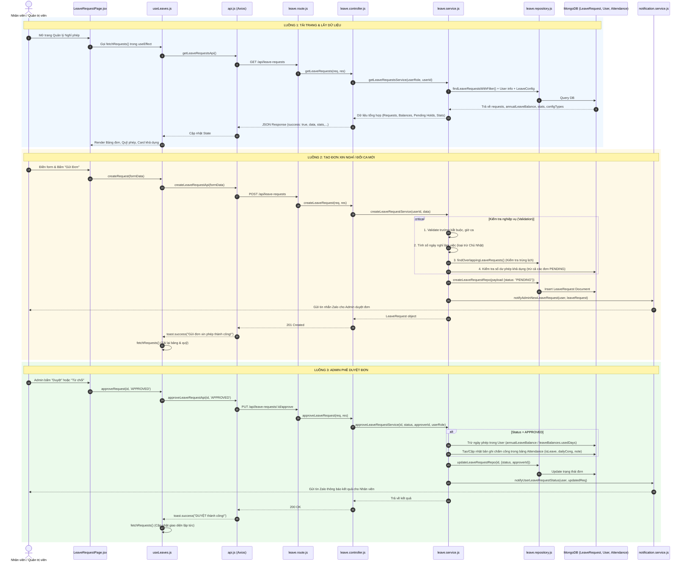

# TÀI LIỆU PHÂN TÍCH LOGIC VÀ LUỒNG CODE QUẢN LÝ NGHỈ PHÉP (LEAVE REQUEST WORKFLOW)

Tài liệu này phân tích chi tiết toàn bộ logic nghiệp vụ, cấu trúc mã nguồn, và luồng dữ liệu (flow) từ giao diện **[LeaveRequestPage.jsx](file:///e:/Users/Tung/Downloads/JussStudio/FE/quanlycongviec/src/pages/LeaveRequestPage.jsx)** đi qua tất cả các file code Frontend, Backend, Database và Hệ thống thông báo.

---

## 1. TỔNG QUAN KIẾN TRÚC & BẢN ĐỒ TẬP TIN (FILE MAP)

```
[FRONTEND - React & Tailwind]
 ├── FE/quanlycongviec/src/pages/LeaveRequestPage.jsx              (Trang chính quản lý nghỉ phép)
 ├── FE/quanlycongviec/src/hooks/useLeaves.js                     (Custom Hook quản lý state & API calls)
 ├── FE/quanlycongviec/src/components/Leave/
 │    ├── LeaveRequestForm.jsx                                    (Form tạo / sửa đơn xin nghỉ & đổi ca)
 │    ├── LeaveRequestList.jsx                                    (Danh sách hiển thị, bộ lọc & duyệt đơn)
 │    ├── LeaveQuotaModal.jsx                                     (Modal xem hạn mức, số ngày còn lại)
 │    ├── CustomDatePicker.jsx                                    (Component chọn ngày tuỳ chỉnh)
 │    └── LeaveShared.js                                          (Danh mục loại nghỉ & hàm format hiển thị)
 └── FE/quanlycongviec/src/services/api.js                        (Cấu hình Axios & Endpoints gọi lên BE)

[BACKEND - Node.js / Express / MongoDB]
 ├── BE/src/routes/leave.route.js                                 (Định tuyến API /api/leave-requests)
 ├── BE/src/controllers/leave.controller.js                       (Tiếp nhận request, xử lý HTTP status)
 ├── BE/src/services/
 │    ├── leave.service.js                                        (Core logic: tính ngày, kiểm tra trùng lặp, trừ quỹ, duyệt đơn)
 │    ├── leaveConfig.service.js                                  (Quản lý cấu hình loại đơn & số ngày phép)
 │    ├── leaveSync.service.js                                    (Đồng bộ và tính toán lại quỹ phép toàn bộ nhân viên)
 │    ├── attendance.service.js                                   (Tích hợp đơn nghỉ vào tính công chấm công hàng ngày)
 │    └── notification.service.js                                 (Gửi tin nhắn Zalo thông báo Admin & User)
 ├── BE/src/repositories/
 │    ├── leave.repository.js                                     (Tương tác DB bảng LeaveRequest)
 │    ├── user.repository.js                                      (Tương tác DB bảng User)
 │    └── attendance.repository.js                                (Tương tác DB bảng Attendance)
 ├── BE/src/model/
 │    ├── LeaveRequest.js                                         (Schema dữ liệu đơn nghỉ phép)
 │    ├── LeaveConfig.js                                          (Schema cấu hình chính sách phép)
 │    └── User.js                                                 (Schema nhân viên, lưu quỹ phép `annualLeaveBalance` & `leaveBalances`)
 └── BE/src/jobs/
      ├── leaveBalanceSyncJob.js                                  (Cron job chạy 00:05 ngày 1 hàng tháng đồng bộ số liệu)
      └── annualLeaveAccumulation.js                              (Cron job reset 12 ngày phép vào 00:00 ngày 1/1 đầu năm)
```

---

## 2. PHÂN LOẠI ĐƠN & LOGIC NGHIỆP VỤ CỐT LÕI (CORE BUSINESS RULES)

Hệ thống chia các loại đơn thành **3 nhóm chính**:

### 2.1. Nhóm Phép năm (Deducts Annual Leave - `deductsLeave: true`)
- **Các loại đơn:** `ANNUAL_LEAVE` (Phép năm), `PREVIOUS_YEAR_LEAVE` (Phép năm trước), `COMPENSATORY_LEAVE` (Nghỉ bù), `SICK_LEAVE` (Nghỉ ốm có giấy), `SUMMER_LEAVE` (Nghỉ mát), thai sản nam, khám NVQS, tránh thai...
- **Quy tắc trừ:** Dùng chung quỹ phép năm của nhân viên (`User.annualLeaveBalance` hoặc chi tiết `leaveBalances`).
- **Kiểm tra số dư khả dụng:** 
  $$\text{Khả dụng} = \text{Tổng phép} - \text{Đã dùng} - \text{Tổng số ngày các đơn đang chờ duyệt (PENDING)}$$
  Nếu $\text{Khả dụng} < \text{Số ngày xin nghỉ}$ $\rightarrow$ Báo lỗi không cho gửi đơn.

### 2.2. Nhóm Phép có hạn mức riêng / Không trừ phép năm (`deductsLeave: false`)
- **Các loại đơn:** `MARRIAGE_LEAVE` (Nghỉ kết hôn - 3 ngày), `BEREAVEMENT_LEAVE` (Nghỉ tang - 3 ngày), `UNPAID_LEAVE` (Nghỉ không lương - không giới hạn),...
- **Quy tắc:** Không trừ vào quỹ phép năm, áp dụng theo cấu hình `maxDays` và `limitUnit` (`year` / `month` / `total`).

### 2.3. Nhóm Đơn đặc biệt (Special Forms)
- **`SHIFT_CHANGE` (Đổi ca làm việc):**
  - Không tính là ngày nghỉ (`totalDays = 0`).
  - Chọn ngày, giờ bắt đầu (`startTime`), giờ kết thúc (`endTime` - hỗ trợ tự động tính dựa trên số giờ làm chuẩn của nhân viên hoặc nhập tay).
  - Khi được duyệt: `attendance.service.js` sẽ dựa vào mốc giờ của ca mới để tính công, nhân viên đến trước giờ này không bị đánh dấu **Đi muộn (LATE)**.
- **`ONLINE_WORK` (Làm việc từ xa / Work From Home):**
  - Đăng ký theo khoảng ngày (`fromDate` $\rightarrow$ `toDate`).
  - Không trừ quỹ phép.
  - Khi duyệt: Tự động ghi nhận ngày chấm công là `PRESENT` với đủ 1.0 hoặc 0.5 công.
- **`LATE_PERMISSION` (Xin phép đi muộn):**
  - Nhập giờ dự kiến đến cơ quan. Khi chấm công, hệ thống không phạt lỗi trễ.
- **`EARLY_LEAVE_REQUEST` (Xin phép về sớm):**
  - Nhập giờ về dự kiến. Chấm công sẽ tính thời gian làm việc đến mốc giờ này, không đánh lỗi Về sớm.

### 2.4. Quy tắc tính số ngày nghỉ (`totalDays`)
- Bỏ qua các ngày **Chủ Nhật** trong khoảng `fromDate` đến `toDate`.
- Nghỉ nửa ngày (`MORNING` / `AFTERNOON`): Bắt buộc `fromDate` phải bằng `toDate`, tính là `0.5 ngày`.
- Nghỉ nhiều ngày: Bắt buộc chọn `FULL_DAY`.

---

## 3. SƠ ĐỒ LUỒNG TỔNG THỂ (MERMAID SEQUENCE DIAGRAM)



---

## 4. CHI TIẾT LUỒNG DỮ LIỆU QUA TỪNG FILE CODE (STEP-BY-STEP FLOW)

### 📌 Luồng 1: Tải trang và tính toán thống kê (Read & Stats Flow)

1. **[LeaveRequestPage.jsx](file:///e:/Users/Tung/Downloads/JussStudio/FE/quanlycongviec/src/pages/LeaveRequestPage.jsx)**:
   - Khi component mount, hook `useLeaves()` được khởi tạo.
   - Nhận về các state: `requests`, `annualLeaveBalance`, `annualMaxDays`, `pendingDeducts`, `leaveBalances`, `stats`, `leaveConfigTypes`.
   - Tính toán nhanh số phép khả dụng hiển thị trên Card đầu trang:
     ```javascript
     {(annualLeaveBalance - (stats?.ANNUAL_LEAVE?.pending || 0)).toFixed(1).replace('.0', '')}
     ```
   - Nếu user là `admin` hoặc `accountant`, mở thêm Tab **Duyệt Đơn (Admin)** kèm số lượng badge đơn `PENDING`.

2. **[useLeaves.js](file:///e:/Users/Tung/Downloads/JussStudio/FE/quanlycongviec/src/hooks/useLeaves.js)**:
   - Hàm `fetchRequests()` kích hoạt `getLeaveRequestsApi()` và set toàn bộ state khi response thành công.

3. **[api.js](file:///e:/Users/Tung/Downloads/JussStudio/FE/quanlycongviec/src/services/api.js)**:
   - `getLeaveRequestsApi = () => api.get('/leave-requests')`. Gửi token JWT trong Header.

4. **[leave.route.js](file:///e:/Users/Tung/Downloads/JussStudio/BE/src/routes/leave.route.js)** $\rightarrow$ **[leave.controller.js](file:///e:/Users/Tung/Downloads/JussStudio/BE/src/controllers/leave.controller.js)**:
   - Route `router.get("/", authenticate, getLeaveRequests)` xác thực token.
   - Controller lấy `req.user.id` và `req.user.role` chuyển vào `getLeaveRequestsService`.

5. **[leave.service.js](file:///e:/Users/Tung/Downloads/JussStudio/BE/src/services/leave.service.js) (`getLeaveRequestsService`)**:
   - **Phân quyền truy vấn:** Nếu là Admin/Kế toán $\rightarrow$ lấy toàn bộ đơn; nếu là nhân viên thường $\rightarrow$ chỉ lấy đơn có `userId = req.user.id`.
   - **Tính `pendingDeducts`:** Lọc các đơn `PENDING` thuộc nhóm trừ phép năm để tính tổng ngày đang chờ duyệt (đang hold).
   - **Xây dựng `stats`:** Duyệt qua danh sách `LeaveConfig.leaveTypes`:
     - Nhóm `deductsLeave`: Quỹ `max` và `remaining` lấy theo quỹ phép năm của User (`annualLeaveBalance`), nhưng đếm `approved` và `pending` riêng cho từng loại đơn.
     - Nhóm `nonDeducts`: Tính `max`, `approved`, `pending`, `remaining` độc lập theo từng loại đơn.

---

### 📌 Luồng 2: Tạo đơn xin nghỉ / Đổi ca mới (Create Request Flow)

1. **[LeaveRequestForm.jsx](file:///e:/Users/Tung/Downloads/JussStudio/FE/quanlycongviec/src/components/Leave/LeaveRequestForm.jsx)**:
   - Người dùng chọn: `fromDate`, `toDate`, `leaveType`, `leaveDuration` (Cả ngày, Ca sáng, Ca chiều), `reason`.
   - Nếu là `SHIFT_CHANGE`:
     - Ẩn chọn `toDate` (mặc định bằng `fromDate`).
     - Chọn giờ bắt đầu `startTime`. Có tuỳ chọn **⚡ Tự tính** hoặc **✏️ Nhập thủ công** `endTime`.
   - Tự động tính số ngày làm việc loại trừ Chủ Nhật bằng hàm `getWorkingDays(fromDate, toDate)`.

2. **[LeaveRequestPage.jsx](file:///e:/Users/Tung/Downloads/JussStudio/FE/quanlycongviec/src/pages/LeaveRequestPage.jsx) (`handleSubmit`)**:
   - Kiểm tra `reason` bắt buộc. Gọi `createRequest(formData)`.

3. **[leave.service.js](file:///e:/Users/Tung/Downloads/JussStudio/BE/src/services/leave.service.js) (`createLeaveRequestService`)**:
   - **Bước 1 (Validate):** Bắt buộc có ngày, lý do, loại đơn. Với đổi ca/về sớm phải có giờ bắt đầu.
   - **Bước 2 (Tính ngày nghỉ):** Vòng lặp `while (tempDate <= end)` đếm ngày khác Chủ Nhật (`getDay() !== 0`). Áp dụng hệ số `0.5` nếu chọn ca sáng/chiều.
   - **Bước 3 (Tính giờ kết thúc ca):** Nếu đổi ca và không nhập `endTime`, tự động lấy giờ chuẩn `user.requiredWorkHours` (hoặc `user.workEndTime - user.workStartTime`) cộng với `startTime` để ra `calculatedEndTime`.
   - **Bước 4 (Chống trùng lặp):** Gọi `findOverlappingLeaveRequests` trong `leave.repository.js` kiểm tra xem nhân viên đã có đơn nào chưa bị từ chối (`status !== "REJECTED"`) trong khoảng thời gian và ca làm này chưa.
   - **Bước 5 (Kiểm tra hạn mức):**
     - Đơn trừ phép năm: Lấy `annualLeaveBalance` trừ tổng ngày các đơn `PENDING`. Nếu $\text{Khả dụng} < \text{totalDays}$ $\rightarrow$ `throw new Error(...)`.
     - Đơn có hạn mức (`maxDays`): Kiểm tra tổng số ngày đã đăng ký trong năm/tháng xem có vượt trần hay không.
   - **Bước 6 (Lưu DB):** Lưu bản ghi vào bảng `LeaveRequest` với trạng thái `PENDING`.
   - **Bước 7 (Thông báo):** Kích hoạt `notifyAdminNewLeaveRequest(user, leaveRequest)` gửi tin Zalo thông báo kèm link phê duyệt cho các Admin có cấu hình `zalo_id`.

---

### 📌 Luồng 3: Phê duyệt / Từ chối đơn (Approval Flow)

1. **[LeaveRequestList.jsx](file:///e:/Users/Tung/Downloads/JussStudio/FE/quanlycongviec/src/components/Leave/LeaveRequestList.jsx)**:
   - Admin xem danh sách lọc theo trạng thái (Chờ duyệt, Đã duyệt, Từ chối), tìm kiếm theo tên/mã nhân viên.
   - Bấm nút **Duyệt** (`APPROVED`) hoặc **Từ chối** (`REJECTED`).

2. **[leave.service.js](file:///e:/Users/Tung/Downloads/JussStudio/BE/src/services/leave.service.js) (`approveLeaveRequestService`)**:
   - **Kiểm tra quyền:** Bắt buộc user thực hiện phải có `role === "admin"` hoặc `"accountant"`.
   - **Xử lý khi DUYỆT (`APPROVED`):**
     1. **Trừ quỹ phép:** Nếu `deductedLeave > 0`, tìm loại phép trong `user.leaveBalances` để tăng `usedDays` hoặc giảm `user.annualLeaveBalance`. Cập nhật vào bảng `User`.
     2. **Tích hợp Chấm công (`Attendance`):**
        - Đối với `ONLINE_WORK`: Tạo bản ghi chấm công `status: PRESENT`, `dailyCong: 1.0` (hoặc 0.5), `isLeave: false`.
        - Đối với các loại nghỉ phép khác (`ANNUAL_LEAVE`, `SICK_LEAVE`,...): Tạo bản ghi chấm công với `isLeave: true`, `leaveType: PAID` (hoặc `UNPAID` nếu nghỉ không lương), `dailyCong: 1.0` (hoặc 0.5).
        - Đối với `SHIFT_CHANGE`, `LATE_PERMISSION`, `EARLY_LEAVE_REQUEST`: Không tạo bản ghi chấm công giả. Service chấm công hàng ngày (`attendance.service.js`) khi quét máy chấm công sẽ tự động đọc trực tiếp từ đơn đã duyệt để áp dụng mốc giờ ca mới và không phạt trễ/về sớm.
   - **Cập nhật đơn:** Ghi nhận `status: "APPROVED" | "REJECTED"` và `approverId`.
   - **Gửi thông báo Zalo:** Gọi `notifyUserLeaveRequestStatus(user, updatedReq)` để báo cho nhân viên biết đơn đã được duyệt hay bị từ chối.

---

### 📌 Luồng 4: Chỉnh sửa và Xóa đơn (Update & Delete Flow)

1. **Chỉnh sửa đơn (`updateLeaveRequestService`)**:
   - Cho phép sửa khi đơn `PENDING` (chủ đơn hoặc Admin) hoặc khi đơn đã `APPROVED` (chỉ Admin).
   - **Cơ chế hoàn nguyên an toàn:** Nếu sửa đơn đã `APPROVED`, hệ thống sẽ:
     1. Hoàn lại số ngày phép đã trừ vào `User.annualLeaveBalance` / `leaveBalances`.
     2. Hoàn tác các bản ghi chấm công `Attendance` đã tạo trước đó.
     3. Cập nhật lại thông tin mới và chạy lại quy trình duyệt (`approveLeaveRequestService`) với dữ liệu mới.

2. **Xóa đơn (`deleteLeaveRequestService`)**:
   - Nhân viên chỉ được xóa đơn `PENDING` của mình.
   - Admin có quyền xóa cả đơn `APPROVED`. Nếu xóa đơn đã `APPROVED`, hệ thống tự động hoàn lại ngày phép cho nhân viên và xóa/phục hồi các bản ghi chấm công liên quan.

---

### 📌 Luồng 5: Đồng bộ dữ liệu & Cron Jobs (Sync & Background Jobs)

1. **[leaveSync.service.js](file:///e:/Users/Tung/Downloads/JussStudio/BE/src/services/leaveSync.service.js) (`syncLeaveBalancesService`)**:
   - Lấy cấu hình chuẩn `LeaveConfig`.
   - Duyệt qua từng nhân viên trong cơ sở dữ liệu:
     - Quét toàn bộ đơn `APPROVED` theo các phạm vi: Toàn thời gian (`total`), trong năm hiện tại (`year`), trong tháng hiện tại (`month`).
     - Tính toán lại `usedDays` chính xác cho từng loại phép.
     - Cập nhật lại `annualLeaveBalance = defaultAnnualDays - tổng phép năm đã dùng trong năm nay`.
   - Có thể kích hoạt thủ công qua API: `POST /api/leave-requests/sync-balances` (Admin only).

2. **[leaveBalanceSyncJob.js](file:///e:/Users/Tung/Downloads/JussStudio/BE/src/jobs/leaveBalanceSyncJob.js)**:
   - Tự động chạy 1 lần khi server khởi động.
   - Chạy định kỳ vào **00:05 ngày 01 hàng tháng** (sau job tích luỹ) để làm mới toàn bộ hạn mức phép của công ty.

3. **[annualLeaveAccumulation.js](file:///e:/Users/Tung/Downloads/JussStudio/BE/src/jobs/annualLeaveAccumulation.js)**:
   - Chạy vào **00:00 ngày 01/01 đầu năm mới**.
   - Cấp mới trọn vẹn 12 ngày phép (`defaultAnnualLeaveDays`) cho toàn bộ nhân viên.

---

## 5. BẢNG TỔNG HỢP CÁC ENDPOINT API LIÊN QUAN

| Method | Endpoint | Quyền hạn | Chức năng | Controller / Service |
| :--- | :--- | :--- | :--- | :--- |
| `GET` | `/api/leave-requests` | Tất cả User | Lấy danh sách đơn & thống kê quỹ phép | `getLeaveRequests` $\rightarrow$ `getLeaveRequestsService` |
| `POST` | `/api/leave-requests` | Tất cả User | Tạo đơn xin nghỉ / đổi ca mới | `createLeaveRequest` $\rightarrow$ `createLeaveRequestService` |
| `PUT` | `/api/leave-requests/:id` | Chủ đơn / Admin | Cập nhật nội dung đơn | `updateLeaveRequest` $\rightarrow$ `updateLeaveRequestService` |
| `DELETE` | `/api/leave-requests/:id` | Chủ đơn / Admin | Xóa đơn (tự hoàn quỹ nếu đã duyệt) | `deleteLeaveRequest` $\rightarrow$ `deleteLeaveRequestService` |
| `PUT` | `/api/leave-requests/:id/approve` | Admin / Kế toán | Phê duyệt hoặc từ chối đơn | `approveLeaveRequest` $\rightarrow$ `approveLeaveRequestService` |
| `POST` | `/api/leave-requests/sync-balances` | Admin / Kế toán | Đồng bộ lại hạn mức phép toàn công ty | `syncLeaveBalancesService` |
| `POST` | `/api/leave-requests/reset-annual-leave` | Admin / Kế toán | Đặt lại quỹ phép năm về mặc định | `leave.route.js` |
| `POST` | `/api/leave-requests/bulk-set-quota` | Admin / Kế toán | Đặt hạn mức 1 loại phép cho tất cả NV | `leave.route.js` |
| `GET` | `/api/leave-config` | Tất cả User | Lấy cấu hình danh mục các loại nghỉ | `getLeaveConfig` $\rightarrow$ `leaveConfig.service.js` |
| `PUT` | `/api/leave-config` | Admin | Cập nhật cấu hình chính sách nghỉ phép | `updateLeaveConfig` $\rightarrow$ `leaveConfig.service.js` |

---

## 6. ĐIỂM ĐẶC BIỆT & THỰC HÀNH TỐT TRONG CODE (HIGHLIGHTS)

1. **Cơ chế Giữ chỗ phép (Pending Hold Calculation):**
   - Khi nhân viên tạo nhiều đơn cùng lúc, hệ thống tính cả những đơn đang `PENDING` vào số phép đang bị trừ tạm thời, ngăn chặn việc nhân viên lợi dụng lúc đơn chưa duyệt để gửi vượt quá số phép còn lại.
2. **Không tạo bản ghi giả khi Đổi ca / Xin đi muộn / Về sớm:**
   - Hệ thống không chèn record chấm công ảo khi duyệt các đơn `SHIFT_CHANGE` hay `LATE_PERMISSION`. Thay vào đó, service chấm công khi quét vân tay thực tế sẽ đọc đơn đã duyệt làm căn cứ tham chiếu mốc giờ, giúp dữ liệu lịch biểu và báo cáo sạch sẽ.
3. **Hoàn nguyên giao dịch 2 chiều (Rollback & Cascade):**
   - Khi sửa hoặc xóa một đơn đã `APPROVED`, hệ thống tự động hoàn lại quỹ ngày phép và làm sạch các bản ghi chấm công tương ứng, đảm bảo tính toàn vẹn dữ liệu (Data Integrity) giữa các bảng `LeaveRequest`, `User` và `Attendance`.
4. **Thông báo tự động qua Zalo Bot:**
   - Tích hợp Zalo Notification hai chiều: Thông báo cho Admin khi có đơn mới cần duyệt, và thông báo kết quả duyệt/từ chối tức thì về Zalo của nhân viên.
