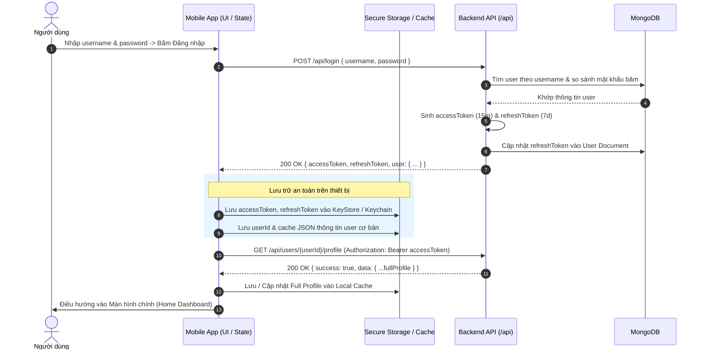
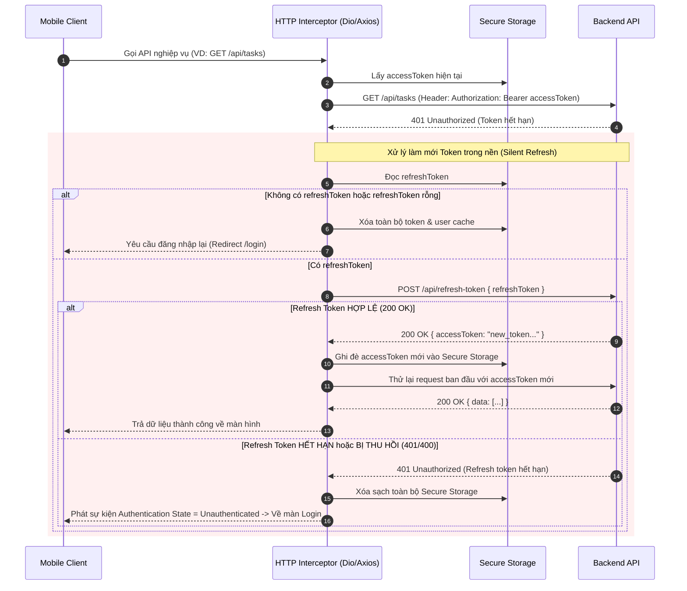
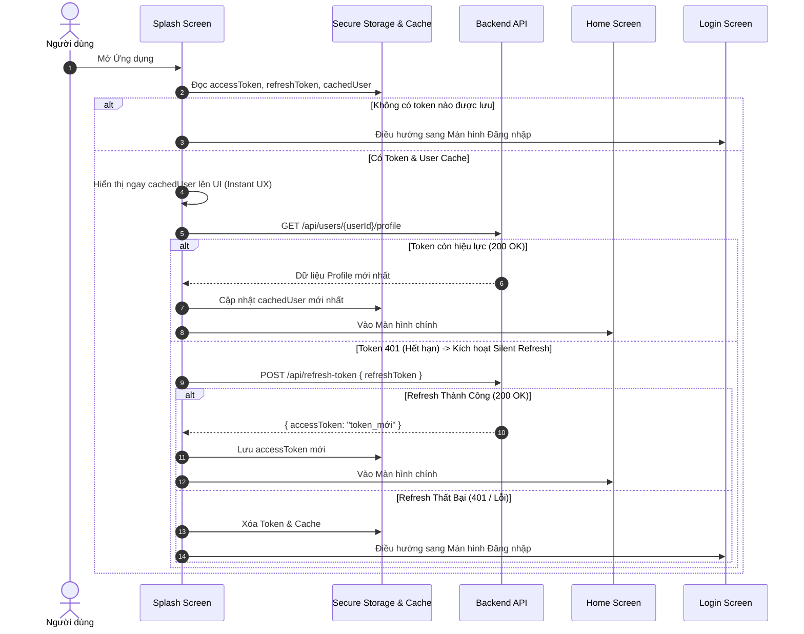

# HƯỚNG DẪN TÍCH HỢP FLOW XÁC THỰC & LƯU TRỮ USER CHO MOBILE APP
*(Dành cho lập trình viên Mobile: Flutter / React Native / iOS / Android)*

---

Tài liệu này đặc tả chi tiết toàn bộ cơ chế **Xác thực (Authentication)**, **Cấp phát & Làm mới Token (Silent Token Refresh)**, **Cấu trúc Dữ liệu Người dùng (User Profile Data Structure)** và **Chiến lược Lưu trữ Cục bộ (Secure Local Storage)** từ Backend của hệ thống. 

Tài liệu được thiết kế nhằm giúp lập trình viên Mobile xây dựng kiến trúc Network Layer, Data Layer và State Management chuẩn xác, hạn chế tối đa lỗi crash do ép kiểu dữ liệu (data type mismatch) hay race condition khi token hết hạn.

---

## 1. KIẾN TRÚC XÁC THỰC TỔNG QUAN (AUTH ARCHITECTURE)

Hệ thống sử dụng cơ chế **JWT Kép (Dual-Token Authentication)**:

| Loại Token | Thời gian sống (TTL) | Cơ chế lưu trữ phía Backend | Mục đích sử dụng |
| :--- | :--- | :--- | :--- |
| **`accessToken`** | **15 phút** | Không lưu DB (Stateless JWT) | Đính kèm vào Header `Authorization: Bearer <accessToken>` trong mọi request cần xác thực. |
| **`refreshToken`** | **7 ngày** | Được lưu trong MongoDB (`user.refreshToken`) | Dùng để xin cấp lại `accessToken` mới khi token cũ hết hạn mà không bắt người dùng đăng nhập lại. |

```
┌────────────────────────────────────────────────────────────────────────┐
│                              MOBILE CLIENT                             │
└────┬─────────────────────────────┬───────────────────────────────▲────┘
     │ 1. POST /api/login          │ 3. Gửi Request + Bearer Token │ 5. Token 
     │    (username, password)     │                               │    hết hạn (401)
     ▼                             ▼                               ▼    Tự động Refresh
┌────────────────────────────────────────────────────────────────────────┐
│                              BACKEND API                               │
│                                                                        │
│  - Kiểm tra mật khẩu (bcrypt)                                         │
│  - Tạo accessToken (15m) & refreshToken (7d)                           │
│  - Lưu refreshToken vào DB User                                        │
└────────────────────────────────────────────────────────────────────────┘
```

---

## 2. SƠ ĐỒ LUỒNG CHI TIẾT (SEQUENCE DIAGRAMS)

### 2.1. Luồng Đăng Nhập & Lưu Dữ Liệu (Login Flow)



---

### 2.2. Luồng Tự Động Làm Mới Token (Silent Refresh Interceptor Flow)

Khi `accessToken` hết hạn sau 15 phút, các request tiếp theo sẽ nhận HTTP `401 Unauthorized`. Interceptor trên Mobile sẽ tự động chặn lỗi, âm thầm gọi API refresh token và thử lại request cũ.



---

### 2.3. Luồng Khởi Động App (App Launch / Auto-Login Flow)



---

## 3. CHI TIẾT ĐẶC TẢ API (API SPECIFICATION & CONTRACTS)

- **Base URL:** `http://<SERVER_IP>:<PORT>/api` (hoặc `https://your-domain.com/api`)
- **Headers chung:** `Content-Type: application/json`

---

### 3.1. Đăng Nhập Tài Khoản (`POST /api/login`)

Xác thực thông tin tài khoản, cấp phát cặp Token và thông tin tổng quan của User.

- **Method:** `POST`
- **Path:** `/api/login`
- **Auth required:** ❌ Không

#### Request Body
```json
{
  "username": "user123",
  "password": "Password123"
}
```

#### Response Thành Công (`200 OK`)
```json
{
  "accessToken": "eyJhbGciOiJIUzI1NiIsInR5cCI6IkpXVCJ9...",
  "refreshToken": "eyJhbGciOiJIUzI1NiIsInR5cCI6IkpXVCJ9...",
  "user": {
    "_id": "67b4f535805561a0b37930b1",
    "username": "user123",
    "displayName": "Nguyễn Văn A",
    "email": "vana@example.com",
    "phone": "0987654321",
    "avatar": "https://res.cloudinary.com/.../avatar.jpg",
    "role": "member",
    "department": "67b4f535805561a0b37930aa"
  }
}
```

> [!WARNING]
> **Lưu ý kiểu dữ liệu trường `department` ở API Login:**
> - Ở API `/api/login`, Backend trả về `user.department` là **String ObjectId** (hoặc `null`), **CHƯA** được populate thành Object!
> - Đừng parse trường `department` ở bước này thành Object vì sẽ gây crash trên các ngôn ngữ strongly-typed như Dart/Swift.

#### Response Thất Bại
| HTTP Status | Error Body | Nguyên nhân |
| :--- | :--- | :--- |
| `400 Bad Request` | `{"message": "Thiếu thông tin đăng nhập"}` | Thiếu username hoặc password |
| `400 Bad Request` | `{"message": "Tên đăng nhập không tồn tại"}` | Sai username |
| `400 Bad Request` | `{"message": "Mật khẩu không đúng"}` | Sai mật khẩu |

---

### 3.2. Làm Mới Access Token (`POST /api/refresh-token`)

Cấp lại `accessToken` mới khi token cũ hết hạn (15 phút).

- **Method:** `POST`
- **Path:** `/api/refresh-token`
- **Auth required:** ❌ Không (truyền token qua body)

#### Request Body
```json
{
  "refreshToken": "eyJhbGciOiJIUzI1NiIsInR5cCI6IkpXVCJ9..."
}
```

#### Response Thành Công (`200 OK`)
```json
{
  "accessToken": "eyJhbGciOiJIUzI1NiIsInR5cCI6IkpXVCJ9.new_access_token..."
}
```

#### Response Thất Bại
| HTTP Status | Error Body | Hành vi xử lý của Mobile |
| :--- | :--- | :--- |
| `401 Unauthorized` | `{"message": "Refresh token hết hạn hoặc không hợp lệ"}` | **BẮT BUỘC LOGOUT:** Xóa sạch Local Storage và đá user về màn Login |
| `400 / 401` | `{"message": "Thiếu refresh token"}` | Logout |

---

### 3.3. Lấy Chi Tiết Hồ Sơ Cá Nhân (`GET /api/users/:id/profile`)

Lấy toàn bộ thông tin chi tiết của người dùng: hồ sơ cá nhân, ngày phép (`leaveBalances`), kỹ năng (`skills`), ca làm việc, thông tin ngân hàng, CCCD...

- **Method:** `GET`
- **Path:** `/api/users/:id/profile` (Trong đó `:id` là `user._id` lấy từ Login)
- **Auth required:** ✅ Có (`Authorization: Bearer <accessToken>`)

> [!IMPORTANT]
> **Quy tắc bảo mật Backend:** `:id` truyền trên URL **BẮT BUỘC PHẢI KHỚP** với `userId` được mã hóa bên trong `accessToken`. Nếu truyền `id` của người khác, Backend sẽ trả về `403 Forbidden`.

#### Response Thành Công (`200 OK`)
```json
{
  "success": true,
  "data": {
    "_id": "67b4f535805561a0b37930b1",
    "username": "user123",
    "employeeCode": "EMP001",
    "displayName": "Nguyễn Văn A",
    "email": "vana@example.com",
    "phone": "0987654321",
    "avatar": "https://res.cloudinary.com/.../avatar.jpg",
    "role": "member",
    "department": {
      "_id": "67b4f535805561a0b37930aa",
      "name": "Phòng Kỹ Thuật"
    },
    "gender": "male",
    "maritalStatus": "single",
    "date_of_birth": "1995-08-20T00:00:00.000Z",
    "address": "123 Đường Cầu Giấy, Hà Nội",
    "bank_account": "1903388888888",
    "bank_name": "Techcombank",
    "employeeType": "FULL_TIME",
    "position": "Senior Mobile Developer",
    "job_title": "Kỹ sư phần mềm",
    "requiredWorkHours": 8,
    "workStartTime": "08:00",
    "workEndTime": "17:00",
    "workingDays": [1, 2, 3, 4, 5, 6],
    "annualLeaveBalance": 12,
    "annualLeaveAccrualPerMonth": 1,
    "leaveBalances": [
      {
        "leaveType": "ANNUAL_LEAVE",
        "totalDays": 12,
        "daysPerMonth": 1,
        "usedDays": 2,
        "_id": "67b4f535805561a0b37930cc"
      }
    ],
    "skills": [
      {
        "name": "Flutter",
        "level": 8,
        "_id": "67b4f535805561a0b37930dd"
      }
    ],
    "lateTaskRate": 0,
    "earlyTaskRate": 0,
    "completionRate": 95,
    "capabilityIndex": 1.1,
    "createdAt": "2025-01-10T08:00:00.000Z",
    "updatedAt": "2025-02-18T10:00:00.000Z"
  }
}
```

> [!TIP]
> **Điểm khác biệt của `department` ở API Profile:**
> Tại đây `department` đã được populate thành Object `{ "_id": string, "name": string }` (hoặc `null` nếu user chưa được gán phòng ban).

---

### 3.4. Cập Nhật Hồ Sơ Cá Nhân (`PUT /api/users/:id/profile`)

Cho phép người dùng tự cập nhật thông tin cá nhân trên ứng dụng Mobile.

- **Method:** `PUT`
- **Path:** `/api/users/:id/profile`
- **Auth required:** ✅ Có (`Authorization: Bearer <accessToken>`)

#### Phân quyền cập nhật (Authorization Rule):
- **User thường (`role !== "admin"`):** Chỉ được sửa các trường thông tin cá nhân: `displayName`, `phone`, `avatar`, `address`, `gender`, `maritalStatus`, `date_of_birth`, `nationality`, `ethnic`, `bank_account`, `bank_name`, `home_phone`, `homeland_phone`, `relationships_homeland_phone`, `before_image_id_card`, `after_image_id_card`, `id_card_number`, `date_of_issue`, `place_of_issue`, `date_of_expiry`, `parmanent_address`, `current_address`, `tax_code`, `social_insurance_number`, `relationships`, `skills`.
- *Các trường nhạy cảm như `role`, `department`, `baseSalary`, `employeeCode`, `annualLeaveBalance`, `workingDays`,... sẽ tự động bị Backend lọc bỏ nếu user thường cố tình gửi lên.*

#### Request Body Mẫu
```json
{
  "displayName": "Nguyễn Văn A (Updated)",
  "phone": "0912345678",
  "address": "Số 456 Giải Phóng, Hà Nội",
  "gender": "male",
  "maritalStatus": "married",
  "bank_account": "1903399999999",
  "bank_name": "Techcombank"
}
```

#### Response Thành Công (`200 OK`)
```json
{
  "success": true,
  "message": "Profile updated successfully",
  "data": {
    "_id": "67b4f535805561a0b37930b1",
    "displayName": "Nguyễn Văn A (Updated)",
    "phone": "0912345678",
    "updatedAt": "2025-02-19T14:30:00.000Z"
    // ...các trường khác sau update
  }
}
```

---

### 3.5. Đăng Xuất (`POST /api/logout`)

Hủy phiên đăng nhập: Xóa `refreshToken` trong database của Backend để token này không thể dùng refresh được nữa.

- **Method:** `POST`
- **Path:** `/api/logout`
- **Auth required:** ✅ Có (`Authorization: Bearer <accessToken>`)

#### Request Body
```json
{}
```

#### Response Thành Công (`200 OK`)
```json
{
  "message": "Đăng xuất thành công"
}
```

---

### 3.6. Đổi Mật Khẩu (`POST /api/change-password`)

- **Method:** `POST`
- **Path:** `/api/change-password`
- **Auth required:** ✅ Có (`Authorization: Bearer <accessToken>`)

#### Request Body
```json
{
  "currentPassword": "OldPassword123",
  "newPassword": "NewPassword456"
}
```

#### Response Thành Công (`200 OK`)
```json
{
  "message": "Đổi mật khẩu thành công!",
  "data": {
    "id": "67b4f535805561a0b37930b1",
    "username": "user123",
    "email": "vana@example.com",
    "displayName": "Nguyễn Văn A"
  }
}
```

---

### 3.7. Quên Mật Khẩu & Đặt Lại Mật Khẩu (Forgot / Reset Password)

#### Bước 1: Yêu cầu gửi mã OTP về Email (`POST /api/forgot-password`)
- **Body:** `{ "email": "vana@example.com" }`
- **Response 200:** `{ "success": true, "message": "Mã xác thực đã được gửi" }`

#### Bước 2: Xác nhận OTP & Đặt lại mật khẩu mới (`POST /api/reset-password`)
- **Body:**
```json
{
  "email": "vana@example.com",
  "otp": "123456",
  "newPassword": "NewPassword789"
}
```
- **Response 200:** `{ "success": true, "message": "Đặt lại mật khẩu thành công!" }`

---

## 4. BẢNG TRA CỨU & DATA MODEL TYPES (CHO MOBILE CODE)

### 4.1. Chi Tiết Các Trường Của User Schema

| Tên trường | Kiểu dữ liệu | Nullable? | Mặc định | Mô tả |
| :--- | :--- | :--- | :--- | :--- |
| `_id` | `String` | ❌ Không | MongoDB ObjectId | ID định danh duy nhất của User |
| `username` | `String` | ❌ Không | | Tên đăng nhập |
| `displayName` | `String` | ❌ Không | | Họ và tên hiển thị |
| `email` | `String` | ❌ Không | | Email liên hệ chính |
| `work_email` | `String` | ✅ Có | `null` | Email công việc nội bộ |
| `phone` | `String` | ✅ Có | `null` | Số điện thoại |
| `avatar` | `String` | ✅ Có | `null` | URL hình ảnh đại diện (Cloudinary) |
| `role` | `String` (`enum`) | ❌ Không | `"member"` | Phân quyền: `"admin"`, `"leader"`, `"member"`, `"accountant"` |
| `department` | `Object` / `String` | ✅ Có | `null` | Object `{ _id, name }` (ở Profile) hoặc String ID (ở Login) |
| `employeeCode`| `String` | ✅ Có | `null` | Mã nhân viên (VD: `"NV001"`) |
| `employeeType`| `String` (`enum`) | ❌ Không | `"FULL_TIME"` | `"FULL_TIME"`, `"PART_TIME"`, `"INTERN"`, `"TRY_JOB"`, `"COLLABORATOR"` |
| `position` | `String` | ✅ Có | `""` | Vị trí công tác |
| `job_title` | `String` | ✅ Có | `""` | Chức danh công việc |
| `gender` | `String` (`enum`) | ✅ Có | `null` | `"male"`, `"female"`, `"other"` |
| `maritalStatus`| `String` (`enum`) | ✅ Có | `null` | `"single"`, `"married"`, `"divorced"` |
| `date_of_birth`| `String` (ISO Date)| ✅ Có | `null` | Ngày sinh |
| `address` | `String` | ✅ Có | `""` | Địa chỉ cư trú hiện tại |
| `bank_account`| `String` | ✅ Có | `""` | Số tài khoản ngân hàng |
| `bank_name` | `String` | ✅ Có | `""` | Tên ngân hàng |
| `requiredWorkHours` | `Number` | ❌ Không | `8` | Số giờ làm tiêu chuẩn/ngày |
| `workStartTime` | `String` | ❌ Không | `"08:00"` | Giờ vào ca (`HH:mm`) |
| `workEndTime` | `String` | ❌ Không | `"17:00"` | Giờ tan ca (`HH:mm`) |
| `workingDays` | `List<int>` | ❌ Không | `[1,2,3,4,5,6]` | Danh sách ngày làm việc (1: T2 -> 6: T7, 0: CN) |
| `annualLeaveBalance` | `Number` | ❌ Không | `1` | Tổng số ngày phép năm còn lại |
| `annualLeaveAccrualPerMonth` | `Number` | ❌ Không | `1` | Số ngày phép cộng thêm mỗi tháng |
| `leaveBalances` | `List<LeaveBalance>` | ❌ Không | `[]` | Danh sách chi tiết hạn mức từng loại phép |
| `skills` | `List<Skill>` | ❌ Không | `[]` | Danh sách kỹ năng và level (1 - 10) |
| `capabilityIndex` | `Number` | ❌ Không | `1.0` | Chỉ số năng lực tổng hợp (0.1 - 2.0) |

---

### 4.2. Mẫu Data Model cho Flutter (Dart)

```dart
// lib/models/user_model.dart

class UserModel {
  final String id;
  final String username;
  final String displayName;
  final String email;
  final String? phone;
  final String? avatar;
  final String role;
  final DepartmentModel? department;
  final String? employeeCode;
  final String? employeeType;
  final String? position;
  final String? jobTitle;
  final String? gender;
  final DateTime? dateOfBirth;
  final String? address;
  final String? bankAccount;
  final String? bankName;
  final int requiredWorkHours;
  final String workStartTime;
  final String workEndTime;
  final List<int> workingDays;
  final double annualLeaveBalance;
  final List<LeaveBalanceModel> leaveBalances;
  final List<SkillModel> skills;

  UserModel({
    required this.id,
    required this.username,
    required this.displayName,
    required this.email,
    this.phone,
    this.avatar,
    this.role = 'member',
    this.department,
    this.employeeCode,
    this.employeeType,
    this.position,
    this.jobTitle,
    this.gender,
    this.dateOfBirth,
    this.address,
    this.bankAccount,
    this.bankName,
    this.requiredWorkHours = 8,
    this.workStartTime = "08:00",
    this.workEndTime = "17:00",
    this.workingDays = const [1, 2, 3, 4, 5, 6],
    this.annualLeaveBalance = 0,
    this.leaveBalances = const [],
    this.skills = const [],
  });

  factory UserModel.fromJson(Map<String, dynamic> json) {
    // Xử lý an toàn trường department (có thể là String ID hoặc Map Object)
    DepartmentModel? dept;
    if (json['department'] is Map<String, dynamic>) {
      dept = DepartmentModel.fromJson(json['department']);
    } else if (json['department'] is String && json['department'].isNotEmpty) {
      dept = DepartmentModel(id: json['department'], name: '');
    }

    return UserModel(
      id: json['_id'] ?? json['id'] ?? '',
      username: json['username'] ?? '',
      displayName: json['displayName'] ?? '',
      email: json['email'] ?? '',
      phone: json['phone'],
      avatar: json['avatar'],
      role: json['role'] ?? 'member',
      department: dept,
      employeeCode: json['employeeCode'],
      employeeType: json['employeeType'],
      position: json['position'],
      jobTitle: json['job_title'],
      gender: json['gender'],
      dateOfBirth: json['date_of_birth'] != null 
          ? DateTime.tryParse(json['date_of_birth']) 
          : null,
      address: json['address'],
      bankAccount: json['bank_account'],
      bankName: json['bank_name'],
      requiredWorkHours: json['requiredWorkHours'] ?? 8,
      workStartTime: json['workStartTime'] ?? "08:00",
      workEndTime: json['workEndTime'] ?? "17:00",
      workingDays: (json['workingDays'] as List<dynamic>?)
              ?.map((e) => (e as num).toInt())
              .toList() ??
          [1, 2, 3, 4, 5, 6],
      annualLeaveBalance: (json['annualLeaveBalance'] as num?)?.toDouble() ?? 0.0,
      leaveBalances: (json['leaveBalances'] as List<dynamic>?)
              ?.map((e) => LeaveBalanceModel.fromJson(e))
              .toList() ??
          [],
      skills: (json['skills'] as List<dynamic>?)
              ?.map((e) => SkillModel.fromJson(e))
              .toList() ??
          [],
    );
  }

  Map<String, dynamic> toJson() => {
    '_id': id,
    'username': username,
    'displayName': displayName,
    'email': email,
    'phone': phone,
    'avatar': avatar,
    'role': role,
    'department': department?.toJson(),
    'employeeCode': employeeCode,
    'employeeType': employeeType,
    'position': position,
    'job_title': jobTitle,
    'gender': gender,
    'date_of_birth': dateOfBirth?.toIso8601String(),
    'address': address,
    'bank_account': bankAccount,
    'bank_name': bankName,
  };
}

class DepartmentModel {
  final String id;
  final String name;

  DepartmentModel({required this.id, required this.name});

  factory DepartmentModel.fromJson(Map<String, dynamic> json) => DepartmentModel(
    id: json['_id'] ?? '',
    name: json['name'] ?? '',
  );

  Map<String, dynamic> toJson() => {'_id': id, 'name': name};
}

class LeaveBalanceModel {
  final String leaveType;
  final double totalDays;
  final double daysPerMonth;
  final double usedDays;

  LeaveBalanceModel({
    required this.leaveType,
    this.totalDays = 0,
    this.daysPerMonth = 0,
    this.usedDays = 0,
  });

  factory LeaveBalanceModel.fromJson(Map<String, dynamic> json) => LeaveBalanceModel(
    leaveType: json['leaveType'] ?? '',
    totalDays: (json['totalDays'] as num?)?.toDouble() ?? 0,
    daysPerMonth: (json['daysPerMonth'] as num?)?.toDouble() ?? 0,
    usedDays: (json['usedDays'] as num?)?.toDouble() ?? 0,
  );
}

class SkillModel {
  final String name;
  final int level;

  SkillModel({required this.name, required this.level});

  factory SkillModel.fromJson(Map<String, dynamic> json) => SkillModel(
    name: json['name'] ?? '',
    level: json['level'] ?? 1,
  );
}
```

---

### 4.3. Mẫu TypeScript Interface cho React Native

```typescript
// types/user.types.ts

export type UserRole = "admin" | "leader" | "member" | "accountant";
export type EmployeeType = "FULL_TIME" | "PART_TIME" | "INTERN" | "TRY_JOB" | "COLLABORATOR";
export type Gender = "male" | "female" | "other";

export interface IDepartment {
  _id: string;
  name: string;
}

export interface ILeaveBalance {
  leaveType: string;
  totalDays: number;
  daysPerMonth: number;
  usedDays: number;
  _id?: string;
}

export interface ISkill {
  name: string;
  level: number;
  _id?: string;
}

export interface IUserProfile {
  _id: string;
  username: string;
  displayName: string;
  email: string;
  work_email?: string;
  phone?: string;
  avatar?: string;
  role: UserRole;
  department?: IDepartment | string | null;
  employeeCode?: string;
  employeeType?: EmployeeType;
  position?: string;
  job_title?: string;
  gender?: Gender;
  maritalStatus?: string;
  date_of_birth?: string;
  address?: string;
  bank_account?: string;
  bank_name?: string;
  requiredWorkHours: number;
  workStartTime: string;
  workEndTime: string;
  workingDays: number[];
  annualLeaveBalance: number;
  annualLeaveAccrualPerMonth: number;
  leaveBalances: ILeaveBalance[];
  skills: ISkill[];
  capabilityIndex?: number;
  createdAt?: string;
  updatedAt?: string;
}

export interface ILoginResponse {
  accessToken: string;
  refreshToken: string;
  user: {
    _id: string;
    username: string;
    displayName: string;
    email: string;
    phone?: string;
    avatar?: string;
    role: UserRole;
    department?: string | null;
  };
}

export interface IRefreshTokenResponse {
  accessToken: string;
}
```

---

## 5. HƯỚNG DẪN THIẾT KẾ LƯU TRỮ (SECURE STORAGE) TRÊN MOBILE

> [!CAUTION]
> **Tuyệt đối KHÔNG lưu `accessToken` và `refreshToken` trong SharedPreferences (Android) hoặc UserDefaults (iOS) chưa mã hóa.**
> Hãy sử dụng các giải pháp bảo mật phần cứng (Hardware-backed Keystore / Keychain).

### 5.1. Bảng Khuyến Nghị Thư Viện Lưu Trữ

| Nền tảng | Dữ liệu nhạy cảm (`accessToken`, `refreshToken`) | Dữ liệu Cache UI (`userProfileCache`, settings) |
| :--- | :--- | :--- |
| **Flutter** | `flutter_secure_storage` | `hive` / `shared_preferences` / `hydrated_bloc` |
| **React Native** | `react-native-keychain` hoặc `expo-secure-store` | `react-native-mmkv` / `@react-native-async-storage/async-storage` |
| **Android Native** | `EncryptedSharedPreferences` / `Android Keystore` | `Room Database` / `DataStore` |
| **iOS Native** | `Keychain Services` | `SwiftData` / `CoreData` / `UserDefaults` |

### 5.2. Danh Sách Key Tiêu Chuẩn Cần Lưu Trữ
- `key_access_token`: Lưu chuỗi JWT Access Token (Secure Storage).
- `key_refresh_token`: Lưu chuỗi JWT Refresh Token (Secure Storage).
- `key_user_id`: Lưu String ID của người dùng.
- `key_user_profile_cache`: Lưu JSON string của đối tượng `IUserProfile` (Dùng để hiển thị giao diện tức thì khi mở app offline trước khi API đồng bộ xong).

---

## 6. MẪU CODE HTTP INTERCEPTOR CHUẨN (AXIOS & DIO)

### 6.1. Mẫu Code Dio Interceptor (Flutter) với `QueuedInterceptor`

`QueuedInterceptor` trong Dio đảm bảo khi có nhiều request đồng thời bị `401`, chỉ duy nhất 1 request refresh token được gửi lên server, các request khác sẽ đợi và tự động retry với token mới.

```dart
// lib/services/api_client.dart
import 'package:dio/dio.dart';
import 'package:flutter_secure_storage/flutter_secure_storage.dart';

class ApiClient {
  static const String baseUrl = 'http://10.0.2.2:5000/api'; // Android Emulator
  late final Dio dio;
  final FlutterSecureStorage _storage = const FlutterSecureStorage();

  ApiClient() {
    dio = Dio(BaseOptions(
      baseUrl: baseUrl,
      connectTimeout: const Duration(seconds: 10),
      receiveTimeout: const Duration(seconds: 10),
      headers: {'Content-Type': 'application/json'},
    ));

    dio.interceptors.add(
      QueuedInterceptorsWrapper(
        // 1. Tự động gắn accessToken vào Header
        onRequest: (options, handler) async {
          final accessToken = await _storage.read(key: 'accessToken');
          if (accessToken != null && accessToken.isNotEmpty) {
            options.headers['Authorization'] = 'Bearer $accessToken';
          }
          return handler.next(options);
        },

        // 2. Bắt lỗi 401 & Tự động Silent Refresh Token
        onError: (DioException error, handler) async {
          if (error.response?.statusCode == 401) {
            try {
              final refreshToken = await _storage.read(key: 'refreshToken');
              if (refreshToken == null || refreshToken.isEmpty) {
                await _handleLogout();
                return handler.reject(error);
              }

              // Gọi API refresh token bằng 1 instance Dio độc lập (tránh vòng lặp interceptor)
              final tokenDio = Dio(BaseOptions(baseUrl: baseUrl));
              final response = await tokenDio.post('/refresh-token', data: {
                'refreshToken': refreshToken,
              });

              if (response.statusCode == 200) {
                final newAccessToken = response.data['accessToken'];
                await _storage.write(key: 'accessToken', value: newAccessToken);

                // Cập nhật lại header cho request cũ và retry
                final options = error.requestOptions;
                options.headers['Authorization'] = 'Bearer $newAccessToken';
                final cloneReq = await dio.fetch(options);
                return handler.resolve(cloneReq);
              }
            } catch (refreshErr) {
              // Refresh token hết hạn hoặc lỗi -> Logout
              await _handleLogout();
              return handler.reject(error);
            }
          }
          return handler.next(error);
        },
      ),
    );
  }

  Future<void> _handleLogout() async {
    await _storage.deleteAll();
    // Dispatch event tới AuthenticationBloc/Provider để chuyển hướng sang màn hình Login
  }
}
```

---

### 6.2. Mẫu Code Axios Interceptor (React Native) Có Hàng Đợi (Queue)

```typescript
// services/api.ts
import axios, { AxiosError, InternalAxiosRequestConfig } from 'axios';
import * as Keychain from 'react-native-keychain';

const BASE_URL = 'http://10.0.2.2:5000/api';

const api = axios.create({
  baseURL: BASE_URL,
  headers: { 'Content-Type': 'application/json' },
});

let isRefreshing = false;
let failedQueue: Array<{
  resolve: (value?: any) => void;
  reject: (reason?: any) => void;
}> = [];

const processQueue = (error: any, token: string | null = null) => {
  failedQueue.forEach(prom => {
    if (error) {
      prom.reject(error);
    } else {
      prom.resolve(token);
    }
  });
  failedQueue = [];
};

// Request Interceptor: Gắn Bearer Token
api.interceptors.request.use(async (config: InternalAxiosRequestConfig) => {
  const credentials = await Keychain.getGenericPassword({ service: 'accessToken' });
  if (credentials) {
    config.headers.Authorization = `Bearer ${credentials.password}`;
  }
  return config;
});

// Response Interceptor: Xử lý 401 & Silent Refresh
api.interceptors.response.use(
  response => response,
  async (error: AxiosError) => {
    const originalRequest: any = error.config;

    if (error.response?.status === 401 && !originalRequest._retry) {
      if (isRefreshing) {
        return new Promise((resolve, reject) => {
          failedQueue.push({ resolve, reject });
        })
          .then(token => {
            originalRequest.headers.Authorization = `Bearer ${token}`;
            return api(originalRequest);
          })
          .catch(err => Promise.reject(err));
      }

      originalRequest._retry = true;
      isRefreshing = true;

      try {
        const refreshCreds = await Keychain.getGenericPassword({ service: 'refreshToken' });
        if (!refreshCreds) {
          throw new Error('No refresh token');
        }

        const res = await axios.post(`${BASE_URL}/refresh-token`, {
          refreshToken: refreshCreds.password,
        });

        const newAccessToken = res.data.accessToken;
        await Keychain.setGenericPassword('token', newAccessToken, { service: 'accessToken' });

        processQueue(null, newAccessToken);
        originalRequest.headers.Authorization = `Bearer ${newAccessToken}`;
        return api(originalRequest);
      } catch (refreshErr) {
        processQueue(refreshErr, null);
        // Xóa token và điều hướng về Login
        await Keychain.resetGenericPassword({ service: 'accessToken' });
        await Keychain.resetGenericPassword({ service: 'refreshToken' });
        // NavigationService.navigate('Login');
        return Promise.reject(refreshErr);
      } finally {
        isRefreshing = false;
      }
    }

    return Promise.reject(error);
  }
);

export default api;
```

---

## 7. CHECKLIST TRIỂN KHAI CHO MOBILE DEVELOPER

| Bước | Hạng mục công việc | Trạng thái | Ghi chú kỹ thuật |
| :---: | :--- | :---: | :--- |
| **1** | Cấu hình Base Network Client (Dio / Axios) | [ ] | Thiết lập Base URL, Timeout (10s), JSON Headers. |
| **2** | Cấu hình Secure Storage | [ ] | Dùng KeyStore/Keychain lưu `accessToken`, `refreshToken`. |
| **3** | Viết Data Models chuẩn | [ ] | Đảm bảo `department` hứng được cả kiểu `String` lẫn `Object`. |
| **4** | Cài đặt Request Interceptor | [ ] | Tự động đọc `accessToken` và gắn vào Header `Authorization`. |
| **5** | Cài đặt Response Interceptor (401 Handler) | [ ] | Tạo hàng đợi (Queue) để tránh nhiều request refresh cùng lúc. |
| **6** | Xây dựng Màn hình Login & Lưu Token | [ ] | Lưu `accessToken`, `refreshToken`, `userId` sau khi login 200 OK. |
| **7** | Lấy Full Profile khi vào Home | [ ] | Gọi `GET /api/users/:id/profile` để đồng bộ hạn mức phép, ca làm... |
| **8** | Quản lý Trạng thái Khởi động (Auto-Login) | [ ] | Kiểm tra token khi mở app -> Silent refresh nếu cần -> Vào thẳng Home. |
| **9** | Xử lý Đăng xuất An toàn | [ ] | Gọi `POST /api/logout`, xóa sạch Storage và Reset State. |
| **10**| Màn hình Cập nhật Hồ sơ | [ ] | Gọi `PUT /api/users/:id/profile` với các trường được phép sửa. |

---

*Tài liệu được biên soạn dựa trên source code thực tế của Backend (`BE/src/controllers/user.controller.js`, `BE/src/services/user.service.js`, `BE/src/model/User.js`). Mọi thắc mắc về tích hợp xin liên hệ Backend Team để được hỗ trợ.*
