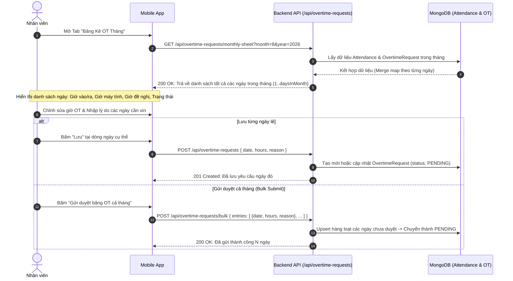
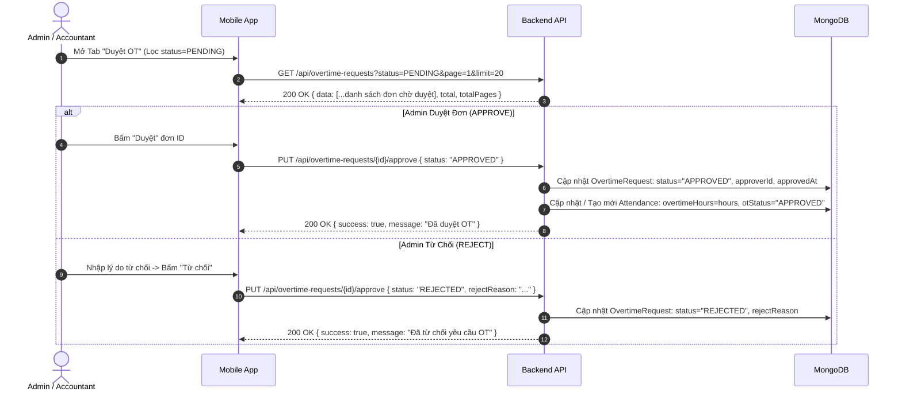
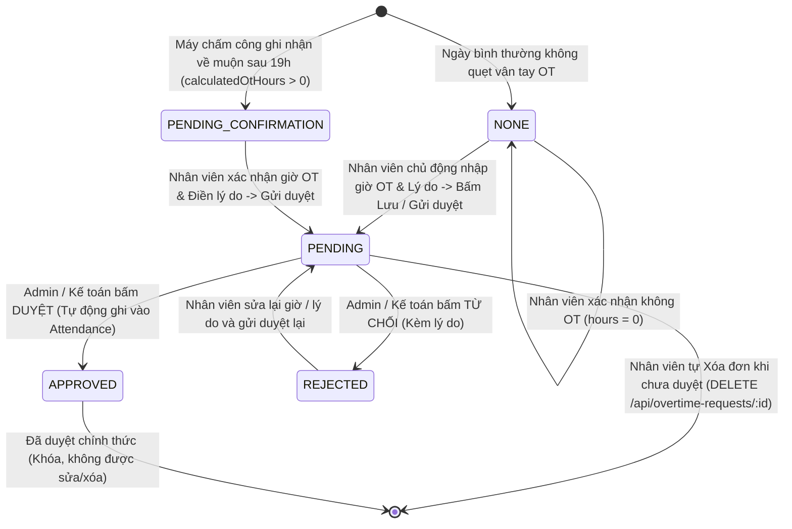

# HƯỚNG DẪN TÍCH HỢP API QUẢN LÝ TĂNG CA (OVERTIME / OT) CHO MOBILE APP
*(Dành cho lập trình viên Mobile: Flutter / React Native / iOS / Android)*

---

Tài liệu này đặc tả chi tiết toàn bộ nghiệp vụ quản lý **Tăng ca (Overtime - OT)** từ Backend: bao gồm quy trình **Kê khai OT từng ngày**, **Kê khai & Gửi duyệt bảng OT cả tháng (Monthly OT Sheet)**, **Quy trình Phê duyệt của Admin/Kế toán**, và cơ chế **Tự động liên kết dữ liệu với Bảng Chấm Công (Attendance) & Tính Lương (Payroll)**.

---

## 1. TỔNG QUAN KIẾN TRÚC VÀ QUY TẮC NGHIỆP VỤ (BUSINESS RULES)

### 1.1. Mối Liên Kết Dữ Liệu: `OvertimeRequest` ➔ `Attendance` ➔ `Payroll`
1. **Dữ liệu Chấm công Máy (`Attendance`)**:
   - Khi nhân viên quẹt vân tay / nhận diện khuôn mặt tan ca sau 19h, hệ thống tự động tính ra `calculatedOtHours` (giờ OT tham chiếu).
2. **Kê khai / Đề xuất của Nhân viên (`OvertimeRequest`)**:
   - Nhân viên có quyền xem lại bảng chấm công của toàn bộ các ngày trong tháng, điều chỉnh `requestedOtHours` (tối đa 8h/ngày) và ghi rõ `reason` (lý do tăng ca).
   - Có thể lưu nháp từng ngày (`POST /api/overtime-requests`) hoặc gửi duyệt hàng loạt cả tháng (`POST /api/overtime-requests/bulk`).
3. **Phê duyệt (`Approve / Reject`)**:
   - Chỉ **Admin** hoặc **Accountant** mới có quyền duyệt đơn OT.
   - Khi đơn chuyển sang trạng thái **`APPROVED`**: Backend tự động đồng bộ `overtimeHours` và `otStatus = "APPROVED"` vào bảng `Attendance` của ngày đó để phục vụ tính lương tự động.

### 1.2. Các Ràng Buộc & Quy Tắc Kiểm Tra (Validation Rules)
- **Giới hạn giờ OT:** Mỗi ngày được xin từ `0.0` đến `8.0` giờ (`0 <= hours <= 8`).
- **Lý do bắt buộc:** Nếu `hours > 0`, bắt buộc phải có `reason` (không được để trống).
- **Trường hợp không OT:** Nhân viên có thể gửi `hours = 0` với lý do `"Không OT"` để xác nhận không tăng ca ngày hôm đó.
- **Tính duy nhất:** Mỗi nhân viên chỉ có **duy nhất 1 bản ghi OT cho 1 ngày** (`userId + date` có Unique Compound Index). Nếu gửi lại ngày đã tồn tại:
  - Nếu trạng thái cũ là `PENDING` hoặc `REJECTED`: Hệ thống tự động ghi đè/cập nhật lại và reset về `PENDING`.
  - Nếu trạng thái cũ là `APPROVED`: Hệ thống chặn không cho phép sửa/xóa (trả về lỗi `409 Conflict` hoặc `400 Bad Request`).

---

## 2. SƠ ĐỒ LUỒNG CHI TIẾT (SEQUENCE & STATE DIAGRAMS)

### 2.1. Luồng Kê Khai Bảng OT Tháng & Gửi Duyệt Hàng Loạt (Monthly Sheet Flow)



---

### 2.2. Luồng Phê Duyệt Của Admin / Kế Toán (Approval Flow)



---

### 2.3. Sơ Đồ Máy Trạng Thái (State Machine Của Một Ngày OT)



---

## 3. CHI TIẾT ĐẶC TẢ TỪNG API (API CONTRACT SPECIFICATIONS)

- **Base URL:** `http://<SERVER_IP>:<PORT>/api/overtime-requests`
- **Headers bắt buộc cho mọi request:**
  ```http
  Content-Type: application/json
  Authorization: Bearer <JWT_ACCESS_TOKEN>
  ```

---

### 3.1. Lấy Bảng Kê OT Toàn Bộ Các Ngày Trong Tháng (`GET /monthly-sheet`)

Endpoint quan trọng nhất cho giao diện kê khai OT trên Mobile. API tự động trả về toàn bộ danh sách các ngày trong tháng (từ ngày 1 đến ngày cuối tháng), ghép sẵn thông tin chấm công thực tế và trạng thái OT.

- **Method:** `GET`
- **Path:** `/api/overtime-requests/monthly-sheet`
- **Quyền:** Mọi User đăng nhập (User thường chỉ xem được của chính mình, Admin/Kế toán có thể truyền thêm `userId` để xem của người khác).

#### Query Parameters:
| Param | Kiểu | Bắt buộc? | Mặc định | Mô tả |
| :--- | :--- | :---: | :--- | :--- |
| `month` | `Number` | ❌ | Tháng hiện tại (1 - 12) | Tháng cần xem |
| `year` | `Number` | ❌ | Năm hiện tại (YYYY) | Năm cần xem |
| `userId`| `String` | ❌ | Token User ID | Chỉ Admin/Kế toán mới được xem bảng kê của người khác |

#### Response Thành Công (`200 OK`):
```json
{
  "success": true,
  "month": 8,
  "year": 2026,
  "data": [
    {
      "id": "67b5e43a9101f30012ab1122",
      "date": "2026-08-01",
      "dayOfWeek": 6,
      "checkIn": "07:55:12",
      "checkOut": "20:30:00",
      "calculatedOtHours": 1.5,
      "requestedOtHours": 1.5,
      "reason": "Fix bug release mobile app",
      "status": "PENDING",
      "rejectReason": "",
      "approverName": ""
    },
    {
      "id": null,
      "date": "2026-08-02",
      "dayOfWeek": 0,
      "checkIn": null,
      "checkOut": null,
      "calculatedOtHours": 0,
      "requestedOtHours": 0,
      "reason": "",
      "status": "NONE",
      "rejectReason": "",
      "approverName": ""
    }
  ]
}
```

#### Ý Nghĩa Các Trường Trong Đối Tượng Ngày (`MonthlySheetItem`):
- `dayOfWeek`: `0` là Chủ nhật, `1` là Thứ hai, ..., `6` là Thứ bảy.
- `calculatedOtHours`: Số giờ OT máy tính tự động từ giờ ra về thực tế.
- `requestedOtHours`: Số giờ nhân viên đề nghị tính OT (mặc định lấy theo `calculatedOtHours` nếu chưa từng tạo đơn).
- `status`:
  - `"NONE"`: Ngày không có tăng ca và chưa gửi đơn.
  - `"PENDING_CONFIRMATION"`: Máy chấm công thấy có về muộn nhưng nhân viên chưa điền lý do và chưa bấm gửi duyệt.
  - `"PENDING"`: Đã gửi đơn và đang chờ Admin duyệt.
  - `"APPROVED"`: Admin đã duyệt (khóa không cho sửa).
  - `"REJECTED"`: Admin từ chối.

---

### 3.2. Gửi / Cập Nhật Yêu Cầu OT Đơn Lẻ (`POST /`)

Dùng khi nhân viên bấm "Lưu" hoặc "Xin OT" cho một ngày cụ thể.

- **Method:** `POST`
- **Path:** `/api/overtime-requests`

#### Request Body:
```json
{
  "date": "2026-08-19",
  "hours": 2.5,
  "reason": "Hỗ trợ deploy máy chủ ban đêm"
}
```

> [!TIP]
> **Quy ước xác nhận "Không OT":**
> Nếu muốn xác nhận ngày đó không tính tăng ca, gửi:
> ```json
> {
>   "date": "2026-08-19",
>   "hours": 0,
>   "reason": "Không OT"
> }
> ```

#### Response Thành Công (`201 Created`):
```json
{
  "success": true,
  "message": "Đã gửi yêu cầu OT thành công",
  "data": {
    "_id": "67b5e43a9101f30012ab1122",
    "userId": "67b4f535805561a0b37930b1",
    "employeeCode": "NV001",
    "date": "2026-08-19",
    "hours": 2.5,
    "reason": "Hỗ trợ deploy máy chủ ban đêm",
    "status": "PENDING",
    "approverId": null,
    "approvedAt": null,
    "rejectReason": "",
    "createdAt": "2026-08-19T14:40:00.000Z",
    "updatedAt": "2026-08-19T14:40:00.000Z"
  }
}
```

#### Response Thất Bại:
| HTTP Status | Error Body | Nguyên nhân |
| :--- | :--- | :--- |
| `400 Bad Request` | `{"success": false, "message": "Vui lòng nhập đầy đủ: ngày, số giờ OT và lý do"}` | Thiếu date, hours hoặc reason rỗng khi hours > 0 |
| `400 Bad Request` | `{"success": false, "message": "Số giờ OT phải từ 0 đến 8 giờ"}` | hours < 0 hoặc hours > 8 |
| `409 Conflict` | `{"success": false, "message": "Yêu cầu OT ngày 2026-08-19 đã được duyệt"}` | Ngày này đã APPROVED, không được phép sửa |

---

### 3.3. Gửi Duyệt Bảng OT Hàng Loạt Cả Tháng (`POST /bulk`)

Dùng khi nhân viên bấm nút **"Gửi duyệt toàn bộ bảng OT tháng"**.

- **Method:** `POST`
- **Path:** `/api/overtime-requests/bulk`

#### Request Body:
```json
{
  "entries": [
    {
      "date": "2026-08-01",
      "hours": 1.5,
      "reason": "Fix bug release"
    },
    {
      "date": "2026-08-05",
      "hours": 2.0,
      "reason": "Họp đối tác ngoài giờ"
    },
    {
      "date": "2026-08-10",
      "hours": 0.0,
      "reason": "Không OT"
    }
  ]
}
```

#### Response Thành Công (`200 OK`):
```json
{
  "success": true,
  "message": "Đã gửi 2 yêu cầu OT (1 mới, 1 cập nhật, 0 bỏ qua)",
  "results": {
    "created": 1,
    "updated": 1,
    "skipped": 0
  }
}
```

---

### 3.4. Lấy Danh Sách Yêu Cầu OT / Màn Hình Duyệt Đơn (`GET /`)

Dành cho:
- **Nhân viên:** Xem lịch sử danh sách các đơn OT của mình kèm trạng thái.
- **Admin / Kế toán:** Xem và lọc tất cả các đơn của toàn bộ nhân viên để duyệt.

- **Method:** `GET`
- **Path:** `/api/overtime-requests`

#### Query Parameters:
| Param | Kiểu | Mô tả |
| :--- | :--- | :--- |
| `page` | `Number` | Trang hiện tại (Mặc định `1`) |
| `limit`| `Number` | Số bản ghi mỗi trang (Mặc định `50`, khuyến nghị `20`) |
| `status`| `String`| Lọc trạng thái: `"ALL"`, `"PENDING"`, `"APPROVED"`, `"REJECTED"` |
| `search`| `String`| Tìm kiếm theo Tên, Username hoặc Mã nhân viên (Dành cho Admin) |
| `date` | `String`| Lọc chính xác ngày: `"YYYY-MM-DD"` |
| `month`| `Number`| Lọc theo tháng (cần gửi kèm `year`) |
| `year` | `Number`| Lọc theo năm |

#### Response Thành Công (`200 OK`):
```json
{
  "success": true,
  "total": 35,
  "page": 1,
  "totalPages": 2,
  "data": [
    {
      "_id": "67b5e43a9101f30012ab1122",
      "userId": {
        "_id": "67b4f535805561a0b37930b1",
        "displayName": "Nguyễn Văn A",
        "username": "vana",
        "email": "vana@company.com",
        "employeeCode": "NV001",
        "avatar": "https://res.cloudinary.com/.../avatar.jpg"
      },
      "employeeCode": "NV001",
      "date": "2026-08-19",
      "hours": 2.5,
      "reason": "Hỗ trợ deploy máy chủ ban đêm",
      "status": "PENDING",
      "approverId": null,
      "approvedAt": null,
      "rejectReason": "",
      "createdAt": "2026-08-19T14:40:00.000Z",
      "updatedAt": "2026-08-19T14:40:00.000Z"
    }
  ]
}
```

---

### 3.5. Duyệt Hoặc Từ Chối Đơn OT (`PUT /:id/approve`)

- **Method:** `PUT`
- **Path:** `/api/overtime-requests/:id/approve`
- **Quyền:** Bắt buộc `role === "admin"` hoặc `role === "accountant"` (Nếu không phải sẽ nhận `403 Forbidden`).

#### Trường hợp 1: DUYỆT ĐƠN (`APPROVED`)
```json
{
  "status": "APPROVED"
}
```
**Phản hồi `200 OK`:**
```json
{
  "success": true,
  "message": "Đã duyệt OT",
  "data": {
    "_id": "67b5e43a9101f30012ab1122",
    "status": "APPROVED",
    "approverId": {
      "_id": "67b4f535805561a0b37930aa",
      "displayName": "Giám Đốc Kỹ Thuật",
      "username": "admin"
    },
    "approvedAt": "2026-08-19T15:00:00.000Z"
  }
}
```

#### Trường hợp 2: TỪ CHỐI ĐƠN (`REJECTED`)
```json
{
  "status": "REJECTED",
  "rejectReason": "Không có kế hoạch OT đã đăng ký từ trước"
}
```
**Phản hồi `200 OK`:**
```json
{
  "success": true,
  "message": "Đã từ chối yêu cầu OT",
  "data": {
    "_id": "67b5e43a9101f30012ab1122",
    "status": "REJECTED",
    "rejectReason": "Không có kế hoạch OT đã đăng ký từ trước",
    "approvedAt": "2026-08-19T15:00:00.000Z"
  }
}
```

---

### 3.6. Xóa Đơn OT (`DELETE /:id`)

Nhân viên tự xóa đơn OT của mình (chỉ thực hiện được khi đơn đang ở trạng thái `PENDING` hoặc `REJECTED`, không thể xóa đơn đã `APPROVED`).

- **Method:** `DELETE`
- **Path:** `/api/overtime-requests/:id`

#### Response:
- **`200 OK`:** `{ "success": true, "message": "Đã xóa yêu cầu OT" }`
- **`400 Bad Request`:** `{ "success": false, "message": "Không thể xóa yêu cầu đã được duyệt" }`
- **`403 Forbidden`:** `{ "success": false, "message": "Bạn không có quyền xóa yêu cầu này" }`

---

## 4. BẢNG MÃ TRẠNG THÁI & MÀU SẮC GỢI Ý CHO GIAO DIỆN (UI COLOR SCHEME)

| Trạng thái (`status`) | Ý nghĩa nghiệp vụ | Màu chữ / Tag (Tailwind / Hex) | Gợi ý Icon |
| :--- | :--- | :--- | :--- |
| **`NONE`** | Không có OT | `#94A3B8` (Slate-400 / Xám) | ⚪ Trống |
| **`PENDING_CONFIRMATION`** | Chờ nhân viên xác nhận & điền lý do | `#D97706` (Amber-600 / Vàng cam) | ⚠️ Cảnh báo |
| **`PENDING`** | Đã gửi, chờ Admin/Kế toán duyệt | `#2563EB` (Blue-600 / Xanh dương) | ⏳ Đồng hồ cát |
| **`APPROVED`** | Đã được phê duyệt chính thức | `#16A34A` (Green-600 / Xanh lá) | ✅ Dấu tích xanh |
| **`REJECTED`** | Bị từ chối phê duyệt | `#DC2626` (Red-600 / Đỏ) | ❌ Dấu X đỏ |

---

## 5. MẪU DATA MODEL SẴN CÓ CHO MOBILE CODE

### 5.1. Mẫu Model Dart cho Flutter

```dart
// lib/models/overtime_model.dart

enum OtStatus {
  none,
  pendingConfirmation,
  pending,
  approved,
  rejected,
}

extension OtStatusExtension on OtStatus {
  String get value {
    switch (this) {
      case OtStatus.none:
        return 'NONE';
      case OtStatus.pendingConfirmation:
        return 'PENDING_CONFIRMATION';
      case OtStatus.pending:
        return 'PENDING';
      case OtStatus.approved:
        return 'APPROVED';
      case OtStatus.rejected:
        return 'REJECTED';
    }
  }

  static OtStatus fromString(String? status) {
    switch (status?.toUpperCase()) {
      case 'PENDING_CONFIRMATION':
        return OtStatus.pendingConfirmation;
      case 'PENDING':
        return OtStatus.pending;
      case 'APPROVED':
        return OtStatus.approved;
      case 'REJECTED':
        return OtStatus.rejected;
      default:
        return OtStatus.none;
    }
  }
}

/// Model cho từng dòng trong bảng kê OT tháng (Monthly Sheet Item)
class MonthlyOtSheetItem {
  final String? id;
  final String date; // YYYY-MM-DD
  final int dayOfWeek; // 0: CN, 1: T2,... 6: T7
  final String? checkIn;
  final String? checkOut;
  final double calculatedOtHours;
  double requestedOtHours;
  String reason;
  final OtStatus status;
  final String rejectReason;
  final String approverName;

  MonthlyOtSheetItem({
    this.id,
    required this.date,
    required this.dayOfWeek,
    this.checkIn,
    this.checkOut,
    this.calculatedOtHours = 0.0,
    this.requestedOtHours = 0.0,
    this.reason = '',
    this.status = OtStatus.none,
    this.rejectReason = '',
    this.approverName = '',
  });

  factory MonthlyOtSheetItem.fromJson(Map<String, dynamic> json) {
    return MonthlyOtSheetItem(
      id: json['id'],
      date: json['date'] ?? '',
      dayOfWeek: json['dayOfWeek'] ?? 0,
      checkIn: json['checkIn'],
      checkOut: json['checkOut'],
      calculatedOtHours: (json['calculatedOtHours'] as num?)?.toDouble() ?? 0.0,
      requestedOtHours: (json['requestedOtHours'] as num?)?.toDouble() ?? 0.0,
      reason: json['reason'] ?? '',
      status: OtStatusExtension.fromString(json['status']),
      rejectReason: json['rejectReason'] ?? '',
      approverName: json['approverName'] ?? '',
    );
  }

  Map<String, dynamic> toBulkEntryJson() => {
    'date': date,
    'hours': requestedOtHours,
    'reason': reason.trim(),
  };
}

/// Model cho đơn yêu cầu OT chi tiết (Dành cho màn Duyệt của Admin)
class OvertimeRequestModel {
  final String id;
  final String userId;
  final String displayName;
  final String? employeeCode;
  final String? avatar;
  final String date;
  final double hours;
  final String reason;
  final OtStatus status;
  final String? approverName;
  final DateTime? approvedAt;
  final String rejectReason;
  final DateTime createdAt;

  OvertimeRequestModel({
    required this.id,
    required this.userId,
    required this.displayName,
    this.employeeCode,
    this.avatar,
    required this.date,
    required this.hours,
    required this.reason,
    required this.status,
    this.approverName,
    this.approvedAt,
    this.rejectReason = '',
    required this.createdAt,
  });

  factory OvertimeRequestModel.fromJson(Map<String, dynamic> json) {
    final userObj = json['userId'] is Map<String, dynamic> ? json['userId'] : null;
    final approverObj = json['approverId'] is Map<String, dynamic> ? json['approverId'] : null;

    return OvertimeRequestModel(
      id: json['_id'] ?? '',
      userId: userObj != null ? userObj['_id'] ?? '' : (json['userId'] ?? ''),
      displayName: userObj != null ? userObj['displayName'] ?? '' : '',
      employeeCode: json['employeeCode'] ?? (userObj != null ? userObj['employeeCode'] : ''),
      avatar: userObj?['avatar'],
      date: json['date'] ?? '',
      hours: (json['hours'] as num?)?.toDouble() ?? 0.0,
      reason: json['reason'] ?? '',
      status: OtStatusExtension.fromString(json['status']),
      approverName: approverObj?['displayName'] ?? approverObj?['username'],
      approvedAt: json['approvedAt'] != null ? DateTime.tryParse(json['approvedAt']) : null,
      rejectReason: json['rejectReason'] ?? '',
      createdAt: DateTime.tryParse(json['createdAt'] ?? '') ?? DateTime.now(),
    );
  }
}
```

---

### 5.2. Mẫu TypeScript Interface cho React Native

```typescript
// types/overtime.types.ts

export type OtStatusType = 'NONE' | 'PENDING_CONFIRMATION' | 'PENDING' | 'APPROVED' | 'REJECTED';

export interface IMonthlyOtSheetItem {
  id: string | null;
  date: string; // YYYY-MM-DD
  dayOfWeek: number; // 0..6
  checkIn: string | null;
  checkOut: string | null;
  calculatedOtHours: number;
  requestedOtHours: number;
  reason: string;
  status: OtStatusType;
  rejectReason: string;
  approverName: string;
}

export interface IOvertimeRequest {
  _id: string;
  userId: {
    _id: string;
    displayName: string;
    username: string;
    email: string;
    employeeCode?: string;
    avatar?: string;
  };
  employeeCode?: string;
  date: string;
  hours: number;
  reason: string;
  status: OtStatusType;
  approverId?: {
    _id: string;
    displayName: string;
    username: string;
  } | null;
  approvedAt?: string | null;
  rejectReason?: string;
  createdAt: string;
  updatedAt: string;
}

export interface IBulkOtSubmitPayload {
  entries: Array<{
    date: string;
    hours: number;
    reason: string;
  }>;
}
```

---

## 6. HƯỚNG DẪN THIẾT KẾ MÀN HÌNH & TRẢI NGHIỆM MOBILE (UI/UX BEST PRACTICES)

### 6.1. Màn hình "Kê Khai OT Tháng" (Cho mọi nhân viên)
1. **Bộ chọn Tháng/Năm (`MonthPicker`):** Đặt trên cùng để chuyển đổi nhanh giữa các tháng.
2. **Thống kê tổng quan đầu trang:**
   - Tổng số giờ OT máy tính: `X.X giờ`
   - Tổng số giờ OT nhân viên đề nghị: `Y.Y giờ`
   - Tổng số giờ đã được Admin duyệt: `Z.Z giờ`
3. **Danh sách theo ngày (Calendar / Card List View):**
   - Đánh dấu màu nổi bật cho các ngày Thứ 7 / Chủ nhật.
   - Hiển thị badge: `checkIn` - `checkOut`.
   - Trường nhập liệu `Số giờ OT`: Cho phép nhập số thập phân (bước nhảy `0.5`, min `0`, max `8`).
   - Trường nhập `Lý do`: Input text trực tiếp hoặc mở BottomSheet khi bấm vào.
   - Nút hành động nhanh:
     - Nút **"Lưu ngày này"** (Icon đĩa mềm).
     - Nút **"Không OT"** (Tự động set `hours = 0` và lưu).
4. **Nút ghim cuối màn hình (Floating Bottom Bar):**
   - Nút lớn: **"Gửi duyệt toàn bộ bảng OT tháng"** (Chỉ kích hoạt khi có ít nhất 1 ngày có giờ > 0 và chưa được duyệt).
   - Dialog xác nhận hiển thị tóm tắt: *"Bạn đang gửi duyệt N ngày với tổng cộng M giờ OT. Xác nhận gửi cho Quản lý phê duyệt?"*.

---

### 6.2. Màn hình "Duyệt Yêu Cầu OT" (Cho Admin / Kế toán)
1. **Bộ lọc trạng thái (Segmented Tabs):** `Chờ duyệt (PENDING)` | `Đã duyệt (APPROVED)` | `Đã từ chối (REJECTED)` | `Tất cả (ALL)`.
2. **Thanh tìm kiếm:** Tìm nhanh theo tên nhân viên hoặc mã nhân viên.
3. **Card hiển thị từng đơn:**
   - Avatar + Họ tên nhân viên + Mã nhân viên.
   - Ngày xin OT + Số giờ xin OT (In đậm màu xanh).
   - Lý do OT của nhân viên.
   - Hai nút hành động:
     - **"Duyệt" (Nút xanh):** Xác nhận duyệt ngay.
     - **"Từ chối" (Nút đỏ):** Bật Dialog yêu cầu nhập `Lý do từ chối` trước khi gửi API.

---

## 7. CHECKLIST TRIỂN KHAI CHO LẬP TRÌNH VIÊN MOBILE

| STT | Nhiệm vụ | Đã xong? | Ghi chú |
| :---: | :--- | :---: | :--- |
| **1** | Định nghĩa Data Model (`MonthlyOtSheetItem`, `OvertimeRequestModel`, `OtStatus`) | [ ] | Lưu ý parse nullable an toàn |
| **2** | Viết Service gọi API `GET /monthly-sheet` | [ ] | Hỗ trợ truyền param `month`, `year` |
| **3** | Xây dựng UI Bảng Kê OT Tháng theo từng ngày | [ ] | Hỗ trợ sửa giờ OT & lý do |
| **4** | Viết hàm gọi API lưu từng ngày `POST /` & Xác nhận không OT | [ ] | Validate: `hours >= 0 && hours <= 8` |
| **5** | Viết hàm gọi API `POST /bulk` gửi duyệt cả tháng | [ ] | Kiểm tra bắt buộc nhập lý do cho các ngày có giờ > 0 |
| **6** | Xây dựng Tab Phê Duyệt cho Admin `GET /` | [ ] | Phân trang + Lọc theo Status |
| **7** | Viết hàm gọi API Phê duyệt / Từ chối `PUT /:id/approve` | [ ] | Bắt buộc nhập lý do khi từ chối |
| **8** | Viết hàm Xóa đơn `DELETE /:id` | [ ] | Chỉ cho phép xóa khi đơn còn `PENDING` |

---

*Tài liệu được trích xuất và chuẩn hóa trực tiếp từ mã nguồn Backend (`BE/src/controllers/overtimeRequest.controller.js`, `BE/src/routes/overtimeRequest.route.js`, `BE/src/model/OvertimeRequest.js`).*
