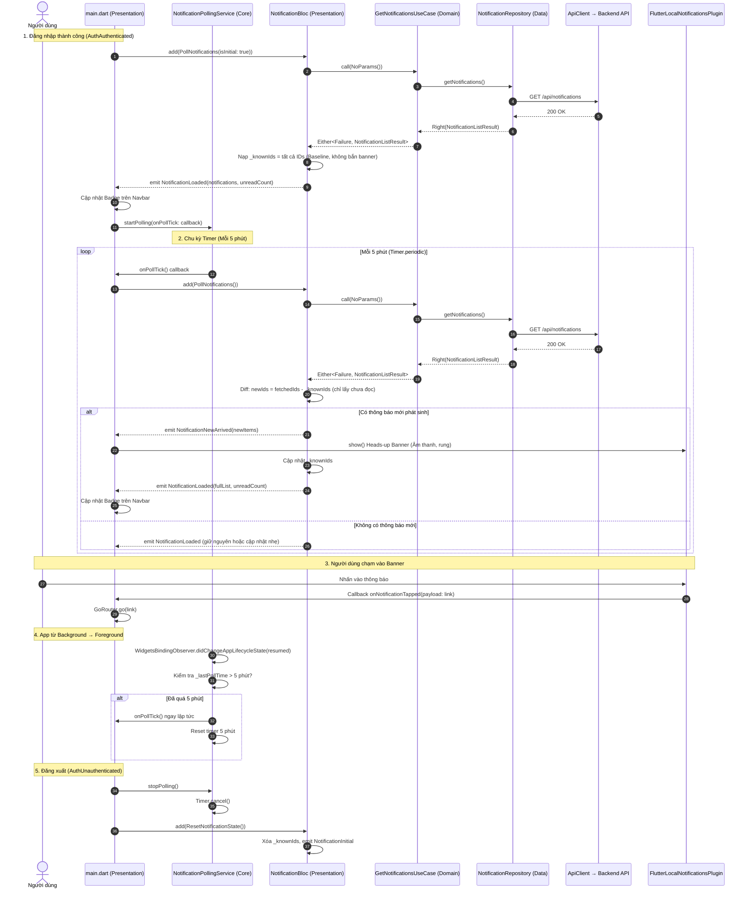

# TÀI LIỆU THIẾT KẾ CHI TIẾT: HỆ THỐNG THÔNG BÁO POLLING (5 PHÚT / LẦN)
*(Thay thế hoàn toàn Firebase Cloud Messaging - FCM)*

---

## 1. Tổng Quan & Lý Do Chuyển Đổi

### 1.1. Bối cảnh
Trước đây hệ thống sử dụng **Firebase Cloud Messaging (FCM)** để gửi push notification từ Backend đến ứng dụng di động Flutter. Tuy nhiên, việc duy trì FCM gặp phải các rào cản:
1. **Phụ thuộc bên thứ ba (Google Firebase)**: Yêu cầu cài đặt Google Play Services trên Android (các máy nội địa/máy ảo/máy không có GMS sẽ gặp lỗi) và chứng chỉ APNs/Apple Developer trên iOS.
2. **Quản lý hạ tầng phức tạp**: Cần lưu trữ Private Key (Service Account JSON), cấu hình biến môi trường, đồng bộ Token thiết bị (`fcmTokens`), xử lý dọn dẹp token rác (token pruning) khi người dùng xóa app.
3. **Môi trường doanh nghiệp nội bộ**: Ứng dụng quản lý nội bộ (`QuanLy`) không đòi hỏi độ trễ tức thời ở mức mili-giây như ứng dụng chat, mà ưu tiên tính ổn định, dễ triển khai, dễ bảo trì và hoàn toàn tự chủ hạ tầng.

### 1.2. Mục tiêu chuyển đổi
- **Xóa bỏ hoàn toàn FCM** khỏi cả Mobile App và Backend.
- **Xây dựng cơ chế Polling thông báo định kỳ 5 phút/lần** trên Mobile App khi người dùng đang đăng nhập.
- **Tích hợp Local Notification Heads-up**: Khi phát hiện thông báo mới qua polling, tự động hiển thị banner thông báo nổi kèm âm thanh/rung và cập nhật badge chưa đọc trên giao diện.
- **Tối ưu hóa tài nguyên**: Xử lý lifecycle thông minh (tạm dừng khi logout, kiểm tra nhanh khi mở lại app, tiết kiệm pin và băng thông mạng).
- **Tuân thủ nghiêm Clean Architecture + BLoC**: Mọi logic nghiệp vụ đi qua đúng luồng `Bloc → UseCase → Repository → DataSource`.

---

## 2. So Sánh Kiến Trúc: FCM vs. Polling 5 Phút

| Tiêu chí | Cơ chế cũ (FCM Push) | Cơ chế mới (Polling 5 phút + Local Notification) |
| :--- | :--- | :--- |
| **Phụ thuộc bên thứ ba** | Phụ thuộc Google Firebase & Apple APNs | **100% Độc lập**, chỉ dùng HTTP REST API nội bộ |
| **Google Play Services** | Bắt buộc trên Android | **Không cần**, hoạt động trên mọi thiết bị Android |
| **Token thiết bị** | Phải đăng ký, refresh, xóa token (`/fcm-token`) | **Không cần token**, dựa theo phiên đăng nhập (JWT) |
| **Backend Service** | Cần `firebase-admin` SDK & Credentials JSON | **Loại bỏ toàn bộ**, chỉ cần lưu vào MongoDB |
| **Độ trễ nhận tin** | 1 - 5 giây | Tối đa **5 phút** (phù hợp hoàn hảo cho thông báo duyệt đơn, task, OT) |
| **Trải nghiệm người dùng** | Banner thông báo nổi, click điều hướng | **Giữ nguyên**: Banner nổi qua `flutter_local_notifications`, click điều hướng GoRouter |
| **Độ phức tạp bảo trì** | Cao (dễ lỗi credentials, APNs cert hết hạn) | **Rất thấp**, ổn định dài hạn |

---

## 3. Kiến Trúc Hệ Thống Polling — Clean Architecture + BLoC

### 3.1. Nguyên tắc phân tách trách nhiệm

Thiết kế tuân thủ nghiêm ngặt Clean Architecture theo đúng pattern hiện có của dự án:

```
┌─────────────────────────────────────────────────────────────────────┐
│  CORE LAYER: core/services/notification_polling_service.dart        │
│                                                                     │
│  Trách nhiệm DUY NHẤT:                                             │
│  ✅ Quản lý Timer.periodic (5 phút)                                │
│  ✅ WidgetsBindingObserver (resume → trigger nếu quá 5 phút)       │
│  ✅ Gọi callback VoidCallback onPollTick() do bên ngoài truyền vào │
│                                                                     │
│  KHÔNG được phép:                                                   │
│  ❌ Import ApiClient (vi phạm: Service → Data Layer)                │
│  ❌ Import NotificationBloc (vi phạm: Core → Presentation)          │
│  ❌ Chứa business logic (diffing, filtering)                        │
└──────────────────────────────┬──────────────────────────────────────┘
                               │ callback onPollTick()
                               ▼
┌─────────────────────────────────────────────────────────────────────┐
│  PRESENTATION LAYER: main.dart (_JussTVAppState)                    │
│                                                                     │
│  Khi onPollTick() được gọi:                                        │
│    context.read<NotificationBloc>().add(PollNotifications())        │
│                                                                     │
│  BlocListener<NotificationBloc, NotificationState>:                 │
│    Khi state chuyển sang NotificationNewArrived →                   │
│    Gọi FlutterLocalNotificationsPlugin.show() hiển thị banner       │
└──────────────────────────────┬──────────────────────────────────────┘
                               │ BLoC Event
                               ▼
┌─────────────────────────────────────────────────────────────────────┐
│  PRESENTATION LAYER: notification_bloc.dart                         │
│                                                                     │
│  on<PollNotifications>:                                             │
│    1. Gọi GetNotificationsUseCase (UseCase đã có, không sửa)       │
│    2. So sánh danh sách mới vs _knownNotificationIds (Set<String>)  │
│    3. Nếu lần đầu (baseline) → nạp IDs, emit NotificationLoaded    │
│    4. Nếu có thông báo mới → emit NotificationNewArrived(newItems)  │
│       rồi emit NotificationLoaded(fullList, unreadCount)            │
└──────────────────────────────┬──────────────────────────────────────┘
                               │ UseCase
                               ▼
┌─────────────────────────────────────────────────────────────────────┐
│  DOMAIN LAYER: notification_usecases.dart                           │
│  - GetNotificationsUseCase (ĐÃ CÓ, KHÔNG CẦN SỬA)                │
└──────────────────────────────┬──────────────────────────────────────┘
                               │ Repository
                               ▼
┌─────────────────────────────────────────────────────────────────────┐
│  DATA LAYER: notification_repository_impl.dart                      │
│  → notification_remote_data_source.dart → ApiClient                 │
│  (ĐÃ CÓ, KHÔNG CẦN SỬA)                                          │
└─────────────────────────────────────────────────────────────────────┘
```

### 3.2. Sơ đồ luồng hoạt động tổng thể (Sequence Diagram)



---

## 4. Thiết Kế Chi Tiết Phía Mobile (Flutter App)

### 4.1. Danh mục các thay đổi cần gỡ bỏ (FCM Cleanup)
1. **`pubspec.yaml`**:
   - Xóa `firebase_core: ^3.6.0`
   - Xóa `firebase_messaging: ^15.1.3`
   - **Giữ lại** `flutter_local_notifications: ^17.2.3` (dùng để bắn banner thông báo nổi cục bộ khi poll được tin mới).
2. **Android Config**:
   - `app/android/app/build.gradle.kts`: Xóa plugin `id("com.google.gms.google-services")`.
   - `app/android/settings.gradle.kts`: Xóa plugin `id("com.google.gms.google-services") version "4.5.0" apply false`.
   - `app/android/app/src/main/AndroidManifest.xml`: Xóa `<meta-data android:name="com.google.firebase.messaging.default_notification_channel_id" ... />`.
   - Xóa file `app/android/app/google-services.json`.
3. **iOS Config**:
   - Xóa file `app/ios/Runner/GoogleService-Info.plist`.
   - `app/ios/Runner/AppDelegate.swift`: Xóa `FirebaseCore`, `FirebaseMessaging`, `FirebaseApp.configure()`, `MessagingDelegate`, và logic xử lý APNs token cho FCM. Giữ lại `UNUserNotificationCenterDelegate` để local notification banner hiển thị được ngay cả khi app đang foreground.
   - `app/ios/Runner/Info.plist`: Bỏ `remote-notification` khỏi `UIBackgroundModes`. Giữ `fetch` nếu cần.
4. **Dart Code**:
   - `app/lib/main.dart`: Xóa `Firebase.initializeApp()`, xóa import `firebase_core`.
   - Xóa file `app/lib/core/services/push_notification_service.dart`.

### 4.2. Component mới: `NotificationPollingService` (Core Layer)

**File**: `app/lib/core/services/notification_polling_service.dart`

**Nguyên tắc**: Service này là một **pure scheduling mechanism** — chỉ quản lý timer và lifecycle, KHÔNG chứa bất kỳ logic nghiệp vụ hay dependency vào tầng Data/Presentation nào.

```dart
/// NotificationPollingService — Core Layer
/// 
/// Chỉ chịu trách nhiệm:
/// 1. Quản lý Timer.periodic (5 phút)
/// 2. Lắng nghe AppLifecycleState (WidgetsBindingObserver)
/// 3. Gọi callback onPollTick khi đến chu kỳ hoặc khi resume app
///
/// KHÔNG import: ApiClient, NotificationBloc, NotificationModel, GoRouter
class NotificationPollingService with WidgetsBindingObserver {
  NotificationPollingService._();
  static final NotificationPollingService instance = NotificationPollingService._();

  static const Duration _pollInterval = Duration(minutes: 5);

  Timer? _pollTimer;
  DateTime? _lastPollTime;
  VoidCallback? _onPollTick;
  bool _isRunning = false;

  /// Bắt đầu polling.
  /// [onPollTick] — callback sẽ được gọi mỗi 5 phút (hoặc khi resume quá hạn).
  void startPolling({required VoidCallback onPollTick}) {
    if (_isRunning) return;
    _isRunning = true;
    _onPollTick = onPollTick;
    _lastPollTime = DateTime.now();

    WidgetsBinding.instance.addObserver(this);
    _pollTimer = Timer.periodic(_pollInterval, (_) => _tick());
  }

  /// Dừng polling và dọn dẹp.
  void stopPolling() {
    _pollTimer?.cancel();
    _pollTimer = null;
    _onPollTick = null;
    _lastPollTime = null;
    _isRunning = false;
    WidgetsBinding.instance.removeObserver(this);
  }

  void _tick() {
    _lastPollTime = DateTime.now();
    _onPollTick?.call();
  }

  /// Khi app từ background → foreground:
  /// Nếu đã quá 5 phút kể từ lần poll cuối → trigger ngay và reset timer.
  @override
  void didChangeAppLifecycleState(AppLifecycleState state) {
    if (state == AppLifecycleState.resumed && _isRunning) {
      final last = _lastPollTime;
      if (last == null || DateTime.now().difference(last) >= _pollInterval) {
        _tick();
        // Reset timer để đảm bảo chu kỳ 5 phút tính từ bây giờ
        _pollTimer?.cancel();
        _pollTimer = Timer.periodic(_pollInterval, (_) => _tick());
      }
    }
  }
}
```

**Lưu ý quan trọng**: File này chỉ import `dart:async` và `package:flutter/widgets.dart`. Không import bất kỳ module nào từ `data/`, `domain/`, `features/`, hay `core/network/`.

### 4.3. Cập nhật BLoC: `NotificationBloc` (Presentation Layer)

BLoC giữ nguyên trách nhiệm fetch dữ liệu qua `GetNotificationsUseCase` và **bổ sung thêm logic diffing/baseline** để phát hiện thông báo mới:

#### 4.3.1. Event mới — `notification_event.dart`
```dart
/// Polling event — được gọi bởi Timer callback qua main.dart
class PollNotifications extends NotificationEvent {
  final bool isInitial; // true = lần đầu sau login (baseline)
  const PollNotifications({this.isInitial = false});
  @override
  List<Object?> get props => [isInitial];
}

/// Reset state khi logout
class ResetNotificationState extends NotificationEvent {}
```

#### 4.3.2. State mới — `notification_state.dart`
```dart
/// State phát ra khi có thông báo MỚI phát sinh (để trigger local banner)
class NotificationNewArrived extends NotificationState {
  final List<NotificationModel> newItems;
  const NotificationNewArrived({required this.newItems});
  @override
  List<Object?> get props => [newItems];
}
```

#### 4.3.3. Handler trong `notification_bloc.dart`
```dart
class NotificationBloc extends Bloc<NotificationEvent, NotificationState> {
  // ... (giữ nguyên các field và handler cũ: _onLoadData, _onMarkRead, _onMarkAllRead)

  /// === POLLING STATE ===
  /// Lưu trữ IDs đã biết để diff với kết quả poll tiếp theo
  final Set<String> _knownNotificationIds = {};
  bool _baselineLoaded = false;

  NotificationBloc({...}) : super(NotificationInitial()) {
    // ... (giữ nguyên các on<> cũ)
    on<PollNotifications>(_onPoll);
    on<ResetNotificationState>(_onReset);
  }

  Future<void> _onPoll(PollNotifications event, Emitter<NotificationState> emit) async {
    final failureOrData = await getNotifications(NoParams());
    failureOrData.fold(
      (failure) {
        // Polling thất bại → im lặng, không show lỗi, đợi chu kỳ sau
        debugPrint('⚠️ Poll notifications failed: ${failure.message}');
      },
      (data) {
        final fetchedIds = data.notifications.map((n) => n.id).toSet();

        if (event.isInitial || !_baselineLoaded) {
          // === BASELINE: Lần đầu sau login ===
          // Nạp toàn bộ IDs hiện có, KHÔNG bắn banner cho thông báo cũ
          _knownNotificationIds
            ..clear()
            ..addAll(fetchedIds);
          _baselineLoaded = true;

          emit(NotificationLoaded(
            notifications: data.notifications,
            unreadCount: data.unreadCount,
          ));
        } else {
          // === POLL TIẾP THEO: So sánh diff ===
          final newUnreadItems = data.notifications
              .where((n) => !_knownNotificationIds.contains(n.id) && !n.isRead)
              .toList();

          // Cập nhật known IDs
          _knownNotificationIds.addAll(fetchedIds);

          if (newUnreadItems.isNotEmpty) {
            // Phát state đặc biệt để Presentation layer bắn Local Notification banner
            emit(NotificationNewArrived(newItems: newUnreadItems));
          }

          // Luôn emit state cập nhật danh sách đầy đủ
          emit(NotificationLoaded(
            notifications: data.notifications,
            unreadCount: data.unreadCount,
          ));
        }
      },
    );
  }

  Future<void> _onReset(ResetNotificationState event, Emitter<NotificationState> emit) async {
    _knownNotificationIds.clear();
    _baselineLoaded = false;
    emit(NotificationInitial());
  }
}
```

### 4.4. Cập nhật `main.dart` (Presentation Layer)

`main.dart` là nơi **kết nối** PollingService (Core) với BLoC (Presentation) và LocalNotification (UI side-effect):

```dart
class _JussTVAppState extends State<JussTVApp> {
  // ... (giữ nguyên _authBloc, _router, _dataLoaded)
  bool _localNotifInitialized = false;
  final FlutterLocalNotificationsPlugin _localNotifications =
      FlutterLocalNotificationsPlugin();

  // Khởi tạo Local Notification plugin (1 lần duy nhất)
  Future<void> _initLocalNotifications() async {
    if (_localNotifInitialized) return;
    _localNotifInitialized = true;
    // ... (giữ nguyên logic tạo Android channel, init plugin, callback tap)
  }

  // Xử lý khi nhận state NotificationNewArrived từ BLoC
  void _showLocalNotificationBanner(NotificationModel item) {
    _localNotifications.show(
      item.hashCode,
      item.title,
      item.body,
      const NotificationDetails(
        android: AndroidNotificationDetails(
          'high_importance_channel',
          'Thông Báo Quan Trọng',
          importance: Importance.high,
          priority: Priority.high,
        ),
        iOS: DarwinNotificationDetails(
          presentAlert: true,
          presentBadge: true,
          presentSound: true,
        ),
      ),
      payload: item.link,
    );
  }

  // Trong build() → BlocListener:
  // Khi AuthAuthenticated:
  //   1. _initLocalNotifications()
  //   2. context.read<NotificationBloc>().add(PollNotifications(isInitial: true))
  //   3. NotificationPollingService.instance.startPolling(
  //        onPollTick: () => context.read<NotificationBloc>().add(PollNotifications()),
  //      )
  //
  // Khi AuthUnauthenticated:
  //   1. NotificationPollingService.instance.stopPolling()
  //   2. context.read<NotificationBloc>().add(ResetNotificationState())

  // Thêm BlocListener lồng thứ 2 cho NotificationBloc:
  //   Khi state là NotificationNewArrived:
  //     for (final item in state.newItems) {
  //       _showLocalNotificationBanner(item);
  //     }
}
```

### 4.5. Xử lý Deep Link khi nhấn vào Banner (Presentation Layer)

Logic điều hướng khi người dùng nhấn vào local notification banner được xử lý trong callback `onDidReceiveNotificationResponse` của `FlutterLocalNotificationsPlugin` ở `main.dart`:

```dart
void _onLocalNotificationTapped(NotificationResponse response) {
  final rawLink = response.payload;
  if (rawLink != null && rawLink.trim().isNotEmpty) {
    final link = rawLink.trim().startsWith('/') ? rawLink.trim() : '/${rawLink.trim()}';
    WidgetsBinding.instance.addPostFrameCallback((_) {
      try {
        _router.go(link);
      } catch (e) {
        debugPrint('⚠️ Không thể điều hướng đến $link: $e');
      }
    });
  }
}
```

---

## 5. Thiết Kế Chi Tiết Phía Backend (Node.js & MongoDB)

### 5.1. Dọn dẹp FCM trên Backend
1. **Gỡ bỏ thư viện**:
   ```bash
   npm uninstall firebase-admin
   ```
2. **Xóa cấu hình**:
   - Xóa bỏ file cấu hình Firebase (`config/firebase.js`).
   - Xóa các biến môi trường: `FIREBASE_CREDENTIALS_PATH`, `FIREBASE_SERVICE_ACCOUNT_BASE64` khỏi `.env` và file deploy.
   - Xóa thư mục chứa credentials JSON.
3. **Cập nhật User Schema**:
   - Loại bỏ trường `fcmTokens: []` khỏi Mongoose User Schema:
     ```javascript
     // Xóa bỏ đoạn này trong models/User.js:
     // fcmTokens: [{ token: String, device: String, createdAt: Date }]
     ```
4. **Xóa bỏ các API liên quan đến Token**:
   - Xóa `POST /api/users/fcm-token` (đăng ký token).
   - Xóa `DELETE /api/users/fcm-token` (hủy token).
   - Xóa cron job kiểm tra token hỏng (token pruning).

### 5.2. Chuẩn hóa Notification Schema & Indexes (MongoDB)
Để hỗ trợ polling định kỳ 5 phút cho hàng trăm/hàng nghìn user mà không gây tải cho Database, cần đảm bảo đánh Index tối ưu:

```javascript
const mongoose = require('mongoose');

const NotificationSchema = new mongoose.Schema({
  recipient: {
    type: mongoose.Schema.Types.ObjectId,
    ref: 'User',
    required: true,
    index: true,
  },
  sender: {
    type: mongoose.Schema.Types.ObjectId,
    ref: 'User',
    default: null,
  },
  type: {
    type: String,
    enum: [
      'TASK_ASSIGNED', 'TASK_TRANSFER_REQUEST', 'TASK_TRANSFER_APPROVED', 'TASK_TRANSFER_REJECTED',
      'PROJECT_ASSIGNED', 'LEAVE_REQUEST', 'LEAVE_APPROVED', 'LEAVE_REJECTED',
      'OT_REQUEST', 'OT_APPROVED', 'OT_REJECTED', 'WORKFLOW_APPROVAL',
      'TASK_DEADLINE', 'MENTION', 'TICKET_NEW', 'TICKET_UPDATED', 'SYSTEM'
    ],
    default: 'SYSTEM',
  },
  title: { type: String, required: true },
  body: { type: String, required: true },
  link: { type: String, default: '' },
  isRead: { type: Boolean, default: false, index: true },
  metadata: { type: mongoose.Schema.Types.Mixed, default: {} },
}, {
  timestamps: true,
});

// Index phức hợp giúp query danh sách thông báo theo user và sắp xếp cực nhanh (<1ms)
NotificationSchema.index({ recipient: 1, createdAt: -1 });
NotificationSchema.index({ recipient: 1, isRead: 1 });

module.exports = mongoose.model('Notification', NotificationSchema);
```

### 5.3. API Endpoint chuẩn hóa cho Polling
API `GET /api/notifications` đã có sẵn, trả về danh sách thông báo và số lượng chưa đọc:

```javascript
// controllers/notificationController.js
exports.getNotifications = async (req, res) => {
  try {
    const userId = req.user._id;
    const limit = Math.min(parseInt(req.query.limit, 10) || 20, 50);

    const [notifications, unreadCount] = await Promise.all([
      Notification.find({ recipient: userId })
        .sort({ createdAt: -1 })
        .limit(limit)
        .populate('sender', 'name displayName avatar')
        .lean(),
      Notification.countDocuments({ recipient: userId, isRead: false }),
    ]);

    return res.status(200).json({
      success: true,
      notifications,
      unreadCount,
    });
  } catch (error) {
    console.error('Lỗi getNotifications:', error);
    return res.status(500).json({ success: false, message: 'Lỗi máy chủ.' });
  }
};
```

### 5.4. Hàm helper tạo thông báo (Notification Trigger)
Khi có sự kiện mới phát sinh (ví dụ: quản lý duyệt đơn nghỉ phép, phân công task, phê duyệt OT), Backend chỉ cần tạo bản ghi trong collection `Notification`. Không cần gọi Firebase Admin SDK:

```javascript
// services/notificationHelper.js
const Notification = require('../models/Notification');

/**
 * Tạo thông báo mới cho người dùng.
 * App di động sẽ tự phát hiện qua polling 5 phút.
 */
async function sendNotification({ recipientId, senderId = null, type, title, body, link = '', metadata = {} }) {
  try {
    const notification = await Notification.create({
      recipient: recipientId,
      sender: senderId,
      type,
      title,
      body,
      link,
      metadata,
    });
    return notification;
  } catch (error) {
    console.error('Lỗi tạo notification:', error);
    return null;
  }
}

module.exports = { sendNotification };
```

---

## 6. Tổng Kết Phân Tách Trách Nhiệm Theo Clean Architecture

| Tầng | Component | Trách nhiệm |
|:------|:----------|:------------|
| **Core** | `NotificationPollingService` | Timer 5 phút, WidgetsBindingObserver, gọi callback. **Không biết** về Bloc, API, hay Model. |
| **Presentation** | `main.dart` | Kết nối Service ↔ BLoC. Lắng nghe BLoC state để bắn Local Notification banner. Xử lý deep-link khi tap banner. |
| **Presentation** | `NotificationBloc` | Xử lý logic nghiệp vụ: gọi UseCase, diff baseline/known IDs, emit state phù hợp (`NotificationLoaded`, `NotificationNewArrived`). |
| **Domain** | `GetNotificationsUseCase` | Gọi Repository. **Không sửa đổi**. |
| **Data** | `NotificationRepositoryImpl` → `NotificationRemoteDataSource` → `ApiClient` | Fetch dữ liệu từ API. **Không sửa đổi**. |

---

## 7. Phân Tích Hiệu Năng & Tối Ưu Nguồn Lực

### 7.1. Tác động về Băng thông & Tải Server
- Chu kỳ: **5 phút = 300 giây**.
- Một người dùng đang mở ứng dụng chỉ tạo ra **12 requests / giờ**.
- Giả sử có 500 nhân viên đang online đồng thời:
  - RPS = 500 / 300 ≈ **1.67 requests/giây**
- **Kết luận**: Mức tải 1.67 req/s là cực kỳ thấp đối với bất kỳ máy chủ Node.js / MongoDB thông thường nào. Băng thông trung bình mỗi response chỉ ~1.5 KB.

### 7.2. Tác động về Pin & CPU trên Thiết bị Di động
- Timer 5 phút chỉ chạy khi ứng dụng đang hoạt động (active / in memory).
- Khi chạy, request HTTP hoàn thành trong khoảng 100 - 300ms rồi ứng dụng quay lại trạng thái nghỉ (idle).
- Không duy trì kết nối WebSocket hay socket ping liên tục, giúp tiết kiệm pin tối đa.
- Khi đăng xuất hoặc tắt hẳn app, timer lập tức bị hủy hoàn toàn (`Timer.cancel()`), không để lại background thread chạy ngầm.

---

## 8. Quy Trình Kiểm Thử & Nghiệm Thu (Test Plan)

1. **Kiểm tra Gỡ bỏ FCM**:
   - Ứng dụng khởi động bình thường không có lỗi `FirebaseException` hay `Default FirebaseApp is not initialized`.
   - `flutter analyze` không còn bất kỳ warning hay import nào liên quan tới Firebase.
2. **Kiểm tra Khởi tạo Polling**:
   - Khi đăng nhập (`AuthAuthenticated`): BLoC nhận `PollNotifications(isInitial: true)` → nạp baseline, cập nhật badge.
   - Lần check đầu tiên (baseline): Không được phát banner hàng loạt cho các thông báo cũ đã tồn tại.
3. **Kiểm tra Chu kỳ 5 Phút & Nhận Thông Báo Mới**:
   - Tạo một thông báo mới trên backend cho tài khoản đang test.
   - Sau chu kỳ 5 phút: BLoC phát hiện ID mới chưa đọc → emit `NotificationNewArrived` → banner nổi hiện lên.
   - Badge trên navbar tự nhảy tăng mà không cần người dùng kéo refresh.
4. **Kiểm tra Tương tác & Điều hướng (Deep Link)**:
   - Nhấn vào banner thông báo nổi → Điều hướng chính xác đến `link` tương ứng qua GoRouter.
5. **Kiểm tra Lifecycle (Background → Foreground)**:
   - Để app ở background > 5 phút → Mở lại → Poll ngay lập tức và reset timer.
6. **Kiểm tra Hủy Polling khi Đăng Xuất**:
   - Đăng xuất → Timer dừng, BLoC nhận `ResetNotificationState` → dọn `_knownIds`, emit `NotificationInitial`.
