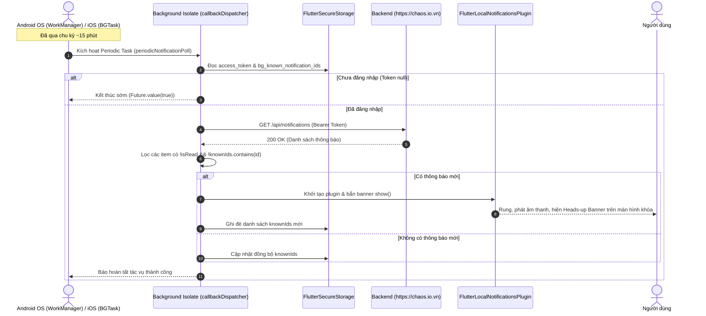
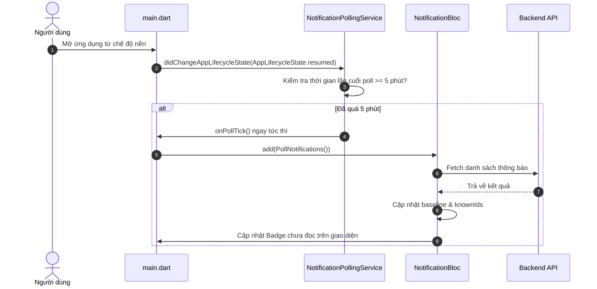

# TÀI LIỆU THIẾT KẾ CHI TIẾT: HỆ THỐNG THÔNG BÁO HYBRID 3 LỚP
### (Foreground 5 Phút + Background WorkManager 15 Phút + Lifecycle Resume)
*(Thay thế hoàn toàn Firebase Cloud Messaging - FCM, tương thích tối đa Android 14 / Flyme OS & iOS)*

---

## 1. Tổng Quan & Lý Do Nâng Cấp Kiến Trúc

### 1.1. Bối cảnh & Vấn đề thực tế
Trước đây, hệ thống đã loại bỏ Firebase Cloud Messaging (FCM) và chuyển sang cơ chế Polling định kỳ bằng Dart `Timer.periodic(Duration(minutes: 5))`. 

Tuy nhiên, khi thử nghiệm thực tế trên các thiết bị chạy Android hiện đại (như **Meizu 21 chạy Flyme 10.5 / Android 14**):
1. **CPU Throttling & Doze Mode**: Ngay khi người dùng thoát ra Home hoặc tắt màn hình, Android OS đóng băng (suspend) CPU của Activity. Dart VM bị tạm dừng hoàn toàn khiến `Timer.periodic` **ngừng chạy**, dẫn đến việc máy để ngầm 20 phút không bao giờ nhận được thông báo.
2. **Quyền thông báo runtime trên Android 13+**: Android 14 bắt buộc phải gọi xin quyền runtime `POST_NOTIFICATIONS`. Nếu chỉ khai báo trong Manifest mà không gọi lệnh popup cấp quyền, Android sẽ âm thầm hủy (silent drop) mọi local notification.
3. **Cơ chế quản lý nền trên iOS**: Apple nghiêm cấm app bên thứ ba chạy loop ngầm vô hạn. Khi không dùng APNs/FCM, giải pháp hợp lệ duy nhất của Apple là **Background App Refresh (`BGAppRefreshTask`)**.

### 1.2. Mục tiêu kiến trúc mới
Xây dựng **Hệ thống Thông Báo Hybrid 3 Lớp** độc lập 100% không phụ thuộc Google Firebase:
- **Lớp 1 - Background định kỳ (15 phút/lần)**: Sử dụng **Android WorkManager** và **iOS BGAppRefreshTask** thông qua thư viện `workmanager`. Chạy trong một Background Isolate riêng biệt, tự động đánh thức hệ thống dậy gọi API và bắn Heads-up Banner cục bộ ngay cả khi app đang đóng hoặc màn hình tắt.
- **Lớp 2 - Lifecycle Resume (Tức thời)**: Khi người dùng mở app từ trạng thái nền, hệ thống kiểm tra ngay lập tức nếu lần kiểm tra cuối đã quá hạn, cập nhật badge và thông báo mới ngay tức thì.
- **Lớp 3 - Foreground Polling (5 phút/lần)**: Khi người dùng đang tương tác với ứng dụng, duy trì chu kỳ 5 phút/lần để cập nhật realtime dữ liệu công việc, đơn từ.
- **Xin quyền Runtime chuẩn mực**: Tự động kích hoạt pop-up xin quyền `POST_NOTIFICATIONS` trên Android 13+ khi người dùng đăng nhập.

---

## 2. So Sánh Kiến Trúc

| Tiêu chí | Cơ chế FCM cũ | Polling Timer thuần (Cũ) | **Kiến trúc Mới: Hybrid 3 Lớp (WorkManager)** |
| :--- | :--- | :--- | :--- |
| **Phụ thuộc bên thứ ba** | Phụ thuộc Google Firebase & Apple APNs | Không | **100% Độc lập**, chỉ dùng HTTP REST API nội bộ |
| **Google Play Services** | Bắt buộc trên Android | Không cần | **Không cần**, hoạt động trên mọi máy nội địa/GMS-free (Meizu, Xiaomi, Huawei...) |
| **Nhận thông báo khi tắt app / khóa màn hình** | Tức thời (< 2s) | ❌ **Không hoạt động** (bị OS đóng băng CPU) | ✅ **Hoạt động ổn định** (WorkManager 15 phút trên Android, BGAppRefresh trên iOS) |
| **Nhận thông báo khi đang mở app (Foreground)** | Banner nổi | Banner nổi (5 phút) | ✅ **Banner nổi (5 phút) + Tức thì khi Resume** |
| **Tác động pin** | Rất thấp | Thấp khi mở, 0% khi tắt | **Cực kỳ thấp**: Dùng chuẩn WorkManager của Google/Apple, chỉ thức dậy vài giây rồi ngủ |
| **Độ phức tạp hạ tầng** | Cao (quản trị token, credentials) | Rất thấp | **Rất thấp**, không cần backend push service |

---

## 3. Kiến Trúc Hệ Thống — Clean Architecture & Multi-Isolate

### 3.1. Phân tách trách nhiệm theo tầng

```
┌────────────────────────────────────────────────────────────────────────────────────────┐
│  CORE LAYER                                                                            │
│                                                                                        │
│  1. NotificationPollingService (Foreground Scheduler):                                │
│     ✅ Timer.periodic (5 phút) khi app đang mở                                         │
│     ✅ WidgetsBindingObserver (đón sự kiện app resume để poll tức thì)                │
│                                                                                        │
│  2. NotificationBackgroundWorker (Native Background Scheduler):                       │
│     ✅ Entrypoint @pragma('vm:entry-point') callbackDispatcher (Background Isolate)    │
│     ✅ WorkManager Periodic Task (15 phút/lần)                                         │
│     ✅ Đọc JWT token từ FlutterSecureStorage                                           │
│     ✅ Gọi REST API /api/notifications trong Isolate nền                                │
│     ✅ So sánh diff với cache bg_known_notification_ids                                │
│     ✅ Bắn Heads-up Banner nổi qua FlutterLocalNotificationsPlugin                     │
│     ✅ Quản lý đăng ký / hủy task theo phiên đăng nhập                                 │
└───────────────────────────────────────────┬────────────────────────────────────────────┘
                                            │
                                            ▼
┌────────────────────────────────────────────────────────────────────────────────────────┐
│  PRESENTATION LAYER (main.dart & BLoC)                                                 │
│                                                                                        │
│  main.dart:                                                                            │
│  ✅ Yêu cầu quyền thông báo POST_NOTIFICATIONS runtime trên Android 13+ (Meizu 21)     │
│  ✅ Khởi tạo NotificationBackgroundWorker.initialize() trong main()                   │
│  ✅ Khi AuthAuthenticated: Bật Polling Service + Đăng ký WorkManager Task 15 phút       │
│  ✅ Khi AuthUnauthenticated: Tắt Polling Service + Hủy WorkManager Task                │
│                                                                                        │
│  NotificationBloc:                                                                     │
│  ✅ Xử lý sự kiện PollNotifications (Foreground)                                       │
│  ✅ Nạp baseline & diffing ID thông báo mới                                            │
│  ✅ Đồng bộ danh sách knownIds sang FlutterSecureStorage để Background Worker chia sẻ  │
└────────────────────────────────────────────────────────────────────────────────────────┘
```

---

## 4. Sơ Đồ Luồng Hoạt Động Chi Tiết (Sequence Diagrams)

### 4.1. Luồng 1: Chạy ngầm trong túi quần / Khóa màn hình (WorkManager 15 phút)



### 4.2. Luồng 2: Khi người dùng mở app (App Resume / Foreground)



---

## 5. Chi Tiết Triển Khai Kỹ Thuật (Implementation Details)

### 5.1. Background Worker (`notification_background_worker.dart`)
- **Tập tin**: `app/lib/core/services/notification_background_worker.dart`
- **Chức năng**:
  - `callbackDispatcher()`: Chạy trên Isolate nền độc lập, kết nối mạng thông qua Dio, kiểm tra và diff dữ liệu.
  - `initialize()`: Khởi tạo WorkManager framework ở cấp độ native.
  - `registerPeriodicTask()`: Đăng ký chu kỳ 15 phút với ràng buộc `NetworkType.connected` và chính sách `ExistingPeriodicWorkPolicy.update`.
  - `cancelPeriodicTask()`: Hủy task khi đăng xuất.
  - `syncKnownIds()` / `clearKnownIds()`: Đồng bộ và dọn dẹp cache giữa UI Isolate và Background Isolate.

### 5.2. Cấp quyền Thông Báo Runtime Android 14 (`main.dart`)
- **Tập tin**: `app/lib/main.dart`
- **Xử lý**:
  ```dart
  final androidPlugin = _localNotifications
      .resolvePlatformSpecificImplementation<
          AndroidFlutterLocalNotificationsPlugin>();
  if (androidPlugin != null) {
    await androidPlugin.requestNotificationsPermission(); // Popup xin quyền Android 13+
    await androidPlugin.createNotificationChannel(
      const AndroidNotificationChannel(
        'high_importance_channel',
        'High Importance Notifications',
        description: 'Kênh thông báo quan trọng cho tác vụ, dự án và đơn từ.',
        importance: Importance.max,
      ),
    );
  }
  ```

### 5.3. Cấu hình Native Android & iOS
1. **Android (`AndroidManifest.xml`)**:
   - `android.permission.INTERNET`
   - `android.permission.POST_NOTIFICATIONS`
   - WorkManager Android library tự động merge `WorkManagerInitializer` vào application manifest.
2. **iOS (`Info.plist` & `AppDelegate.swift`)**:
   - Khai báo `UIBackgroundModes`: `fetch`, `processing`.
   - Khai báo `BGTaskSchedulerPermittedIdentifiers`:
     - `be.tramckfd.workmanager.iOSBackgroundAppRefresh`
     - `com.jusstv.QuanLy.notificationRefresh`
   - Thiết lập `UNUserNotificationCenterDelegate` hiển thị banner khi đang mở app.

---

## 6. Phân Tích Hiệu Năng & Nguồn Lực

1. **Tiêu thụ Pin trên Android**:
   - Thay vì chạy một timer liên tục giữ CPU thức 100% thời gian (gây tụt pin nhanh và bị Flyme OS đóng băng), WorkManager tận dụng cơ chế **Doze-friendly** của Android: thiết bị tiếp tục ngủ sâu, chỉ thức dậy vài giây một lần mỗi 15 phút để kiểm tra mạng rồi lập tức tắt CPU trở lại.
2. **Tương thích trên iOS**:
   - Cơ chế `BGAppRefreshTask` hoàn toàn hợp chuẩn quy định App Store của Apple, không bị từ chối duyệt ứng dụng.
3. **Băng thông mạng**:
   - Mỗi chu kỳ 15 phút chỉ gửi 1 request `GET /api/notifications` (~1.5 KB payload gzip). Một ngày 24h chạy nền chỉ tiêu tốn chưa đến 150 KB dung lượng dữ liệu 4G/Wi-Fi.

---

## 7. Quy Trình Kiểm Thử Thiết Bị Thực Tế (Test Guide - Meizu 21 / Android 14)

1. **Kiểm tra Popup Xin quyền**:
   - Khởi động app sau khi cài mới $\rightarrow$ Kiểm tra popup hệ thống *"Cho phép Juss TV gửi thông báo cho bạn"* xuất hiện $\rightarrow$ Bấm **Cho phép**.
2. **Kiểm tra Chạy ngầm 15 phút**:
   - Đăng nhập tài khoản trên Meizu 21.
   - Bấm nút Home thoát ra màn hình chính, hoặc bấm phím nguồn khóa màn hình máy.
   - Trên máy tính hoặc thiết bị khác, tạo 1 Task mới hoặc duyệt 1 đơn nghỉ phép gửi tới tài khoản đang test.
   - Sau chu kỳ ~15 phút của WorkManager, điện thoại Meizu 21 sẽ sáng chuông/rung và xuất hiện Banner thông báo nổi trên màn hình khóa.
3. **Kiểm tra Điều hướng (Deep-link)**:
   - Chạm vào thông báo nổi $\rightarrow$ Ứng dụng mở lên và tự động điều hướng chính xác đến trang chi tiết thông báo hoặc tác vụ tương ứng.
4. **Kiểm tra Đăng xuất**:
   - Bấm Đăng xuất $\rightarrow$ WorkManager hủy task, xóa cache, không còn kích hoạt thông báo ngầm khi đã đăng xuất.
