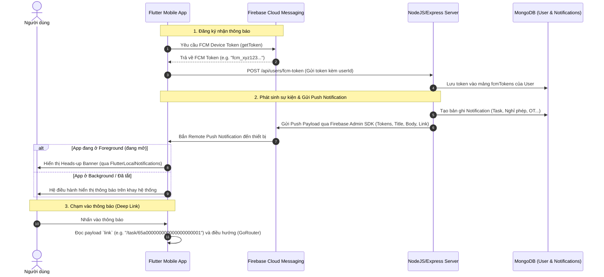

# Kế hoạch thiết lập Push Notification với Firebase Cloud Messaging (FCM) & MongoDB

Tài liệu này vạch ra toàn bộ lộ trình thiết lập hệ thống **Push Notification** cho ứng dụng Flutter trên cả 2 nền tảng **Android** và **iOS**, đồng thời đồng bộ token thiết bị với **MongoDB** ở Backend.

---

## 1. Kiến trúc tổng thể luồng Push Notification



---

## 2. Các thành phần cần triển khai

### A. Cấu hình Firebase & Native Platforms (Android & iOS)

#### 1. Tạo Project trên Firebase Console:
- Truy cập [console.firebase.google.com](https://console.firebase.google.com) và tạo một Firebase Project (hoặc dùng project có sẵn).
- **Android**:
  - Thêm Android app với package name: `com.jusstv.QuanLy` (được cấu hình trong `android/app/build.gradle.kts`).
  - Tải file `google-services.json` đặt vào thư mục `app/android/app/`.
- **iOS**:
  - Thêm iOS app với Bundle ID: `com.jusstv.QuanLy`.
  - Tải file `GoogleService-Info.plist` đặt vào thư mục `app/ios/Runner/`.
  - Cấu hình APNs (Apple Push Notification service): Upload file chứng chỉ APNs Auth Key (`.p8`) lên Firebase Console (Project Settings ➔ Cloud Messaging ➔ Apple app configuration).

#### 2. Cấu hình Gradle Android (`Kotlin DSL`):
- [settings.gradle.kts](file:///c:/Users/Tung/source/QuanLy/app/android/settings.gradle.kts): Thêm Google Services plugin vào khối `plugins {}`:
  ```kotlin
  // Add the dependency for the Google services Gradle plugin
  id("com.google.gms.google-services") version "4.5.0" apply false
  ```
- [build.gradle.kts (app)](file:///c:/Users/Tung/source/QuanLy/app/android/app/build.gradle.kts): Áp dụng plugin:
  ```kotlin
  plugins {
      id("com.android.application")
      id("dev.flutter.flutter-gradle-plugin")
      id("com.google.gms.google-services")
  }
  ```


  
- [AndroidManifest.xml](file:///c:/Users/Tung/source/QuanLy/app/android/app/src/main/AndroidManifest.xml):
  - Thêm quyền `POST_NOTIFICATIONS` cho Android 13+:
    ```xml
    <uses-permission android:name="android.permission.POST_NOTIFICATIONS" />
    ```
  - Cấu hình default notification channel và icon.

#### 3. Cấu hình iOS:
- [Info.plist](file:///c:/Users/Tung/source/QuanLy/app/ios/Runner/Info.plist): Thêm `UIBackgroundModes` cho push notification:
  ```xml
  <key>UIBackgroundModes</key>
  <array>
      <string>fetch</string>
      <string>remote-notification</string>
  </array>
  ```
- [AppDelegate.swift](file:///c:/Users/Tung/source/QuanLy/app/ios/Runner/AppDelegate.swift): Khởi tạo notification delegate.

---

### B. Cập nhật Flutter Dependencies & Core Service

#### 1. Dependencies trong [pubspec.yaml](file:///c:/Users/Tung/source/QuanLy/app/pubspec.yaml):
- `firebase_core: ^3.6.0`
- `firebase_messaging: ^15.1.3`
- `flutter_local_notifications: ^17.2.3` (dùng để hiển thị heads-up banner khi ứng dụng đang mở - Foreground).

#### 2. Xây dựng `PushNotificationService`:
- Tạo file mới: `lib/core/services/push_notification_service.dart`:
  - `initialize()`: Khởi tạo Firebase, xin quyền thông báo (`requestPermission()`), cấu hình local notification channel.
  - `getDeviceToken()`: Lấy FCM token hiện tại.
  - `onTokenRefresh`: Lắng nghe khi token thay đổi để cập nhật lại lên backend.
  - `_handleForegroundMessage()`: Hiển thị banner khi app đang mở.
  - `_handleMessageOpenedApp()`: Đọc `message.data['link']` và điều hướng trực tiếp bằng GoRouter.
  - Background handler: Hàm top-level `@pragma('vm:entry-point') Future<void> firebaseMessagingBackgroundHandler(RemoteMessage message)` để xử lý khi app tắt hoàn toàn.

#### 3. Đồng bộ Token theo vòng đời tài khoản:
- **Khi đăng nhập thành công (`AuthAuthenticated`)**:
  - Lấy FCM Token từ thiết bị ➔ Gọi API `POST /api/users/fcm-token` để lưu vào MongoDB.
- **Khi đăng xuất (`AuthUnauthenticated`)**:
  - Gọi API `DELETE /api/users/fcm-token` ➔ Xóa token trên server ➔ Gọi `FirebaseMessaging.instance.deleteToken()`.

---

### C. Cấu hình Backend (Node.js/Express & MongoDB)

> [!TIP]
> Để server có thể phát thông báo đến đúng người, backend MongoDB cần lưu danh sách token của từng nhân viên.

#### 1. Cập nhật MongoDB Schema (`User` Collection):
Lưu dạng mảng để hỗ trợ 1 nhân viên đăng nhập trên nhiều máy (ví dụ điện thoại công ty + điện thoại cá nhân):
```javascript
// user.model.js
{
  // ... các trường hiện tại ...
  fcmTokens: [
    {
      token: { type: String, required: true },
      device: { type: String, default: "mobile" }, // "android" | "ios"
      updatedAt: { type: Date, default: Date.now }
    }
  ]
}
```

#### 2. Tạo Endpoint nhận Token:
- `POST /api/users/fcm-token`:
  ```javascript
  // Lưu token vào user đang đăng nhập (tránh trùng lặp)
  await User.findByIdAndUpdate(req.user.id, {
    $addToSet: { fcmTokens: { token: req.body.token, device: req.body.device } }
  });
  ```
- `DELETE /api/users/fcm-token`:
  ```javascript
  // Xóa token khi user logout
  await User.findByIdAndUpdate(req.user.id, {
    $pull: { fcmTokens: { token: req.body.token } }
  });
  ```

#### 3. Bắn Push Notification bằng `firebase-admin`:
Khi server tạo một thông báo mới (Task mới, duyệt đơn nghỉ phép, OT, ...):
```javascript
const admin = require("firebase-admin");

async function sendPushNotification(recipientId, { title, body, link, notificationId }) {
  const user = await User.findById(recipientId);
  if (!user || !user.fcmTokens || user.fcmTokens.length === 0) return;

  const tokens = user.fcmTokens.map(t => t.token);
  const payload = {
    notification: { title, body },
    data: {
      link: link || "",
      notificationId: notificationId ? notificationId.toString() : "",
      click_action: "FLUTTER_NOTIFICATION_CLICK"
    }
  };

  const response = await admin.messaging().sendEachForMulticast({
    tokens,
    ...payload
  });

  // Dọn dẹp các token đã hết hạn hoặc bị xóa trên thiết bị
  // response.responses.forEach((resp, idx) => { if (!resp.success) ... })
}
```

---

## 3. Kế hoạch triển khai từng bước (Execution Steps)

1. **Bước 1**: Cập nhật `pubspec.yaml` với `firebase_core`, `firebase_messaging`, `flutter_local_notifications` và chạy `flutter pub get`.
2. **Bước 2**: Cập nhật cấu hình Android (`settings.gradle.kts`, `app/build.gradle.kts`, `AndroidManifest.xml`).
3. **Bước 3**: Cập nhật cấu hình iOS (`Info.plist`, `AppDelegate.swift`).
4. **Bước 4**: Xây dựng `PushNotificationService` xử lý xin quyền, lấy token, foreground banner, background listener và deep link.
5. **Bước 5**: Tích hợp gọi đăng ký token vào luồng `AuthBloc` (khi login thành công gửi token lên API, khi logout xóa token).
6. **Bước 6**: Hướng dẫn thêm 2 file cấu hình bảo mật `google-services.json` và `GoogleService-Info.plist` từ Firebase Console vào dự án.
